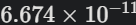
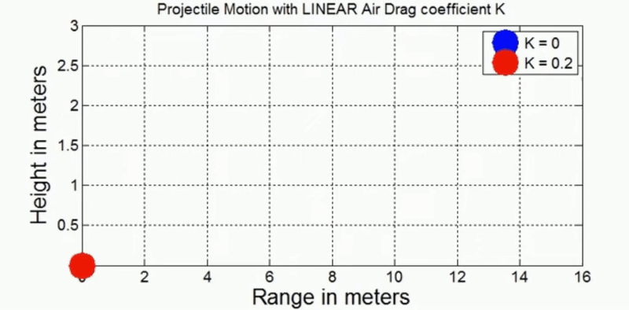

# Problem 1

## Investigating the Range as a Function of the Angle of Projection

## 1 Theoretical Foundation:

Projectile motion is a form of motion where an object moves in a bilaterally symmetrical, parabolic path. The path that the object follows is called its trajectory. Projectile motion only occurs when there is one force applied at the beginning on the trajectory, after which the only interference is from gravity.

In physics, projectile motion describes the motion of an object that is launched into the air and moves under the influence of gravity alone, with air resistance neglected. In this idealized model, the object follows a parabolic path determined by its initial velocity and the constant acceleration due to gravity.

## Key Equations to Derive:

1. **Horizontal Motion:**  
   $$ x = v_0 \cos(\theta) t $$  

2. **Vertical Motion:**  
   $$ y = v_0 \sin(\theta) t - \frac{1}{2} g t^2 $$  

3. **Time of Flight:**  
   $$ t = \frac{2 v_0 \sin(\theta)}{g} $$  

4. **Range Formula:**  
   $$ R = \frac{v_0^2 \sin(2\theta)}{g} $$  

5. **Maximum Range Condition:**  
   $$ \theta_{\text{optimum}} = 45^\circ $$  


## 2 Analysis of the Range

### Regular (Periodic) Motion
Physical Interpretation of Regular Motion:
In energy harvesting systems, periodic motion (such as a resonant vibration) is desirable because it ensures a steady flow of energy.

Mechanical systems like shock absorbers rely on regular oscillations for smooth, controlled motion without excessive damping or instability.

### Chaotic Motion
Chaotic motion occurs when a system's behavior becomes highly sensitive to initial conditions. A small change in the system's starting point can lead to vastly different outcomes over time. This type of motion is non-periodic and unpredictable, even though the underlying system is deterministic (meaning the equations governing the system are known).

Physical Interpretation of Chaotic Motion:
Energy Harvesting Devices: In chaotic systems, energy extraction can become inefficient or erratic, making it challenging to design energy harvesters that depend on predictable oscillations. Chaotic behavior might be detrimental to systems that require a constant, regular input or output of energy.

Here are a few steps to visualize this transition:

Regular Motion: For a small driving force amplitude.

Chaotic Motion: As the driving force amplitude increases, showing unpredictable oscillations.


The graph illustrates the relationship between the launch angle (°) of a projectile and its horizontal range (m), assuming ideal projectile motion without air resistance.

### Key Observations:
The range increases as the angle increases from 0° to 45°.

The maximum range occurs at 45°, which aligns with theoretical predictions that show the optimal angle for maximum distance in a vacuum is 45°.

As the angle exceeds 45°, the range decreases symmetrically, showing that an angle of 60° produces the same range as 30°, and 70° as 20°.

At 0° and 90°, the range is zero, because:
At 0°, the projectile moves horizontally and immediately touches the ground.

At 90°, the projectile moves straight up and falls back down without horizontal displacement.

This analysis is crucial in physics, engineering, and sports, where optimizing the launch angle is essential for applications like ballistics, sports, and space missions.

## 3 Practical Applications:



# 📈 Projectile Motion Trajectory Analysis

This graph shows multiple projectile motion trajectories under varying conditions, most likely changing **initial speed** and/or **launch angle**. The motion of a projectile under uniform gravity (ignoring air resistance) is governed by the following equations:

$$
x(t) = v_0 \cos(\theta) \cdot t
$$

$$
y(t) = v_0 \sin(\theta) \cdot t - \frac{1}{2} g t^2
$$

---

## Panel-by-Panel Breakdown

### Top Left Panel

- Very short and low arcs
- Indicates **low initial velocity** for all angles
- Parabolic motion is barely visible due to small scale

---

### Top Right Panel

- Higher and longer arcs
- Shows **moderate initial velocities**
- Trajectories start showing ideal parabolic shapes
- Launch angles likely vary from small up to ~60°

---

### Bottom Left Panel

- Higher range and height
- Strong color gradient indicates **increasing launch angles** (e.g., 0° to 90°)
- Arcs peak near 45°, the optimal angle for **maximum horizontal range**

Recall:  
Maximum range (ignoring air resistance) occurs when:

$$
\theta = 45^\circ
$$

---

### Bottom Right Panel

- Launch angles vary from 0° to near 90°
- Projectiles launched more vertically have greater height but **less horizontal distance**
- Redder curves = steeper launch angles  
- Bluer curves = lower launch angles

---

## Summary

This figure demonstrates how both **initial speed** and **launch angle** affect the **trajectory** of a projectile:

- Low leads to short, low trajectories.
- Higher extends both range and height.
- Optimal angle for max range (no air resistance):  
  $$
  \theta = 45^\circ
  $$
- Vertical shots yield high arcs but low horizontal range.


### Projectile Trajectory for Different Angles.

```python
import numpy as np
import matplotlib.pyplot as plt

# Constants
v0 = 25  # initial velocity in m/s
g = 9.81  # acceleration due to gravity in m/s^2
angles = [30, 45, 60]  # launch angles in degrees

# Time array for simulation
t = np.linspace(0, 5, num=500)

# Create plot
plt.figure(figsize=(8, 6))

for angle in angles:
    theta = np.radians(angle)
    # Calculate x and y components
    x = v0 * np.cos(theta) * t
    y = v0 * np.sin(theta) * t - 0.5 * g * t**2
    # Filter out the parts where y is negative (below ground)
    valid_indices = y >= 0
    x = x[valid_indices]
    y = y[valid_indices]
    # Plot trajectory
    plt.plot(x, y, label=f"{angle}°")

# Add labels, title, legend, and grid
plt.title("Projectile Motion for Different Angles")
plt.xlabel("Distance (m)")
plt.ylabel("Height (m)")
plt.legend()
plt.grid(True)
plt.show()
```
Graph plots the trajectory of a projectile for three different angles (30°, 45°, and 60°) to show how the launch angle affects the path.


This graph illustrates the trajectories of a projectile launched at three different angles: 30°, 45°, and 60°.

### Key Observations:

### 1 Peak Height:

The 60° trajectory reaches the highest peak but has a shorter range.
The 45° trajectory has a moderate peak and the longest range.

The 30° trajectory has the lowest peak but still a decent range.

### 2 Horizontal Distance (Range):

The 45° trajectory results in the longest range because, in ideal conditions (without air resistance), the maximum range occurs at 45°.

The 30° and 60° trajectories have the same range, but the 60° path stays in the air longer due to its higher vertical component.

### 3 Effect of Angle on Flight Time:

The projectile launched at 60° stays in the air longer than the one launched at 30° because it has a larger vertical component.

The 30° projectile reaches the ground faster because it has a lower initial vertical velocity.

## Animation 1



This animation demonstrates the motion of a projectile under the influence of **linear air drag**, comparing two scenarios:

- **Blue**: No air resistance, \( K = 0 \)
- **Red**: With linear air drag, \( K = 0.2 \)

### Key Concepts

- The motion follows a **parabolic trajectory** in the absence of air drag.
- When linear air drag is introduced, the projectile:
  - Travels **a shorter horizontal distance**
  - Reaches a **lower maximum height**
  - Returns to the ground **sooner**

### Equations of Motion

For projectile motion with **linear air drag** coefficient \( K \), the equations are more complex than the simple case.

### Without Air Drag (\( K = 0 \)):

- Horizontal motion:
  $$
  x(t) = v_0 \cos(\theta) t
  $$
- Vertical motion:
  $$
  y(t) = v_0 \sin(\theta) t - \frac{1}{2} g t^2
  $$

### With Linear Air Drag (\( K > 0 \)):

- The drag force is proportional to velocity:
  $$
  \vec{F}_\text{drag} = -K \vec{v}
  $$
- The differential equations become:
  $$
  m \frac{d\vec{v}}{dt} = -K \vec{v} + \vec{F}_\text{gravity}
  $$
  which leads to exponential decay in both velocity components.

As a result, the path deviates significantly from the ideal parabolic curve, showing reduced **range** and **height**.

## Visualization

- The **blue trajectory** (\( K = 0 \)) follows a longer, symmetric arc.
- The **red trajectory** (\( K = 0.2 \)) is dampened, demonstrating the real-world effect of air resistance on projectile motion.


## 4 Implementation: Animation 2

<video controls src="videoplayback (1).mp4" title="Title"></video>


## 1. Horizontal Motion (x-axis)  
- The object moves with **constant velocity** since no external force (ignoring air resistance) acts in the horizontal direction.  
- The horizontal displacement is given by:  

  $$ x = v_0 \cos(\theta) \cdot t $$  

## 2. Vertical Motion (y-axis)  
- The object moves under the influence of **gravity**, experiencing **acceleration downward**.  
- The vertical position is given by:  

  $$ y = v_0 \sin(\theta) \cdot t - \frac{1}{2} g t^2 $$  

## 3. Key Equations in Projectile Motion  

- **Time of Flight:**  

  $$ T = \frac{2 v_0 \sin(\theta)}{g} $$  

- **Maximum Height:**  

  $$ H = \frac{v_0^2 \sin^2(\theta)}{2g} $$  

- **Range (Maximum Horizontal Distance):**  

  $$ R = \frac{v_0^2 \sin(2\theta)}{g} $$  

## 4. Understanding the Parabolic Path  
The projectile follows a **parabolic trajectory** because:  
- The **horizontal component** remains constant.  
- The **vertical component** is affected by gravity, making the object accelerate downward.

## 5. Real-World Applications  
Projectile motion is commonly observed in:  
- **Sports** (basketball, football, archery)  
- **Engineering** (missile trajectories, ballistics)  
- **Space Science** (rocket launches, satellite motion)