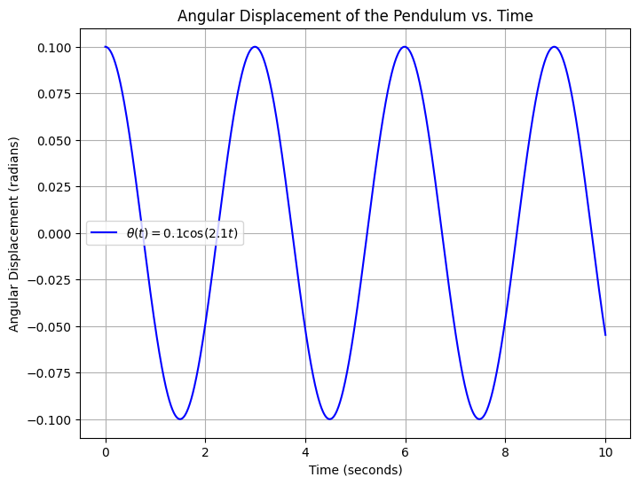
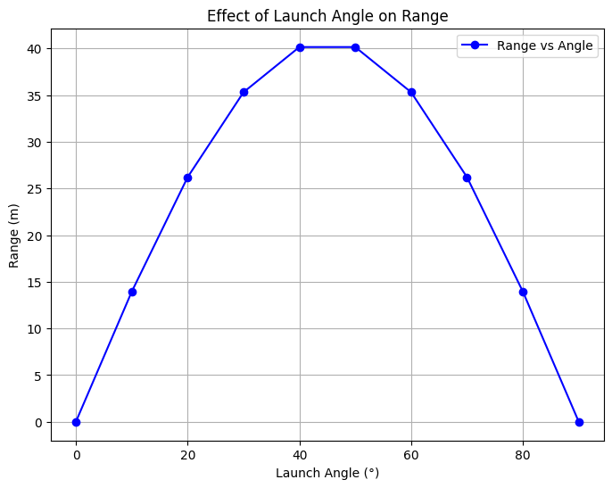
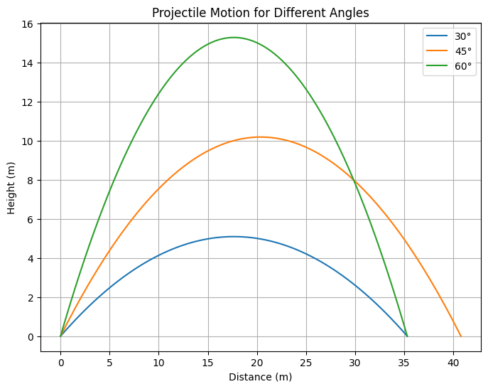
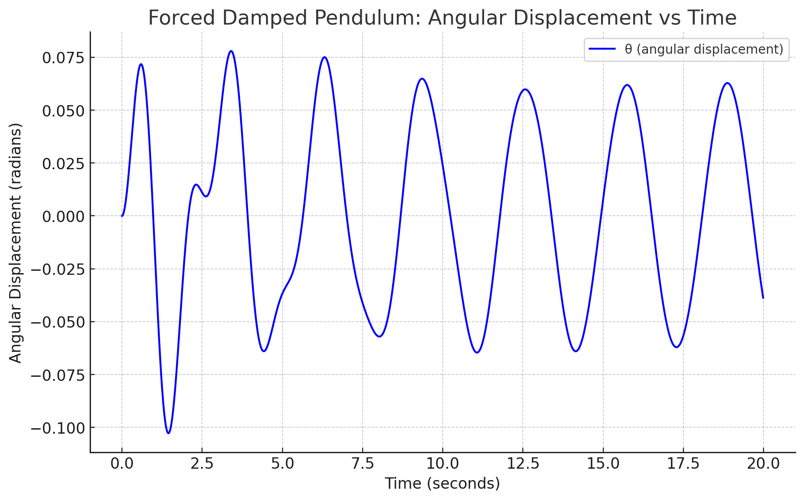
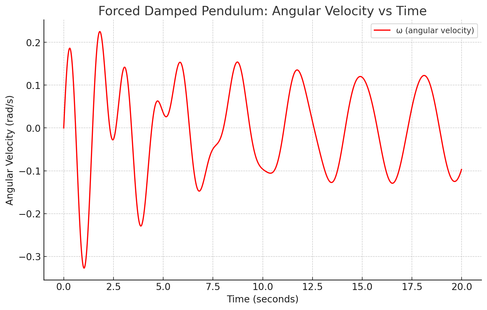

# Problem 1

## Mechanics

### Investigating the Range as a Function of the Angle of Projection

## 1 Theoretical Foundation:

Projectile motion is a form of motion where an object moves in a bilaterally symmetrical, parabolic path. The path that the object follows is called its trajectory. Projectile motion only occurs when there is one force applied at the beginning on the trajectory, after which the only interference is from gravity.

In physics, projectile motion describes the motion of an object that is launched into the air and moves under the influence of gravity alone, with air resistance neglected. In this idealized model, the object follows a parabolic path determined by its initial velocity and the constant acceleration due to gravity.

## Key Equations to Derive:

1. Horizontal Motion: 
$$
x = v0cos(𝜃)t
$$

2. Vertical Motion:
$$
𝑦=𝑣0sin(𝜃)𝑡−1/2𝑔𝑡^2
$$

3. Time of Flight:
$$
t=2 v0sin(θ)​/g
$$

4. Range Formula:
$$
R = v^20sin(2𝜃)/g
$$

5. Maximum Range Condition:
$$
\theta_{optimum} = 45°
$$

## Finding the Period of Oscillation

c 1

## Writing the Equation for Angular Displacement

c 2

```python
import numpy as np
import matplotlib.pyplot as plt

# Time array from 0 to 10 seconds with small steps for smooth plotting
t = np.linspace(0, 10, 1000)

# Angular displacement theta(t) = 0.1 * cos(2.1 * t)
theta = 0.1 * np.cos(2.1 * t)

# Create the plot
plt.figure(figsize=(8, 6))
plt.plot(t, theta, label=r'$\theta(t) = 0.1\cos(2.1t)$', color='blue')

# Add labels and title
plt.xlabel('Time (seconds)')
plt.ylabel('Angular Displacement (radians)')
plt.title('Angular Displacement of the Pendulum vs. Time')
plt.grid(True)

# Add legend
plt.legend()

# Show the plot
plt.show()
```



### This graph shows the angular displacement of a pendulum over time. Let’s break it down step by step:

## Title and Axes:

The title, "Angular Displacement of the Pendulum vs. Time," tells us that the graph shows how the pendulum's angular displacement changes with time.

The x-axis represents "Time (seconds)" — showing the progression of time from 0 to 10 seconds.

The y-axis represents "Angular Displacement (radians)" — showing the angle by which the pendulum swings back and forth, measured in radians.

## The Equation:

The equation in the legend is
$$
𝜃(𝑡)=0.1cos(2.21𝑡)
$$
describing the pendulum's motion.

0.1
0.1 is the amplitude, meaning the maximum angular displacement is ±0.1 radians.

cos(2.21t) shows that the displacement follows a cosine function, indicating simple harmonic motion.

The angular frequency is
2.21 radians per second, which determines how quickly the pendulum oscillates.

## Interpreting the Graph:

The blue curve represents the pendulum's oscillation, moving back and forth in a regular pattern.

The peaks at ±0.1 radians show the maximum displacement, and the points where the curve crosses the x-axis represent moments when the pendulum passes through its equilibrium position.

The period (time to complete one full oscillation) is about
$$ 
2
𝜋
2.21
≈
2.84
 seconds
 $$

## Conclusion:

The pendulum undergoes simple harmonic motion with a constant amplitude of 0.1 radians and oscillates at a frequency dictated by 2.21 radians per second. The graph visualizes the regular back-and-forth motion over time.

## 2 Analysis of the Range

1. Regular (Periodic) Motion
In a system exhibiting regular motion, the behavior of the system repeats at regular intervals. For example, a simple harmonic oscillator or a damped pendulum with a weak external force may exhibit periodic motion where the oscillations occur at a constant amplitude and frequency. This type of motion can be easily described by a mathematical model and is typically stable and predictable.

Physical Interpretation of Regular Motion:
In energy harvesting systems, periodic motion (such as a resonant vibration) is desirable because it ensures a steady flow of energy.

Mechanical systems like shock absorbers rely on regular oscillations for smooth, controlled motion without excessive damping or instability.

For pendulum-based devices, the regular motion might correspond to the pendulum swinging with a fixed frequency, ideal for systems designed to work within a known, controlled environment.

2. Chaotic Motion
Chaotic motion occurs when a system's behavior becomes highly sensitive to initial conditions. A small change in the system's starting point can lead to vastly different outcomes over time. This type of motion is non-periodic and unpredictable, even though the underlying system is deterministic (meaning the equations governing the system are known).

In the context of a forced damped pendulum, chaotic motion can emerge when the system is driven by an external force (like a periodic driving force) with the right combination of amplitude and frequency. Initially, the system may exhibit periodic behavior, but as the driving force's amplitude or frequency increases, the system may transition into chaotic behavior.

Physical Interpretation of Chaotic Motion:
Energy Harvesting Devices: In chaotic systems, energy extraction can become inefficient or erratic, making it challenging to design energy harvesters that depend on predictable oscillations. Chaotic behavior might be detrimental to systems that require a constant, regular input or output of energy.

Mechanical Systems and Vibration: In structures like bridges, buildings, or mechanical systems, chaotic motion could represent resonance effects caused by external forces (like wind or traffic), leading to dangerous vibrations. For instance, chaotic behavior could result in structural fatigue, as unpredictable oscillations might cause stress beyond safe levels.

Pendulum-Based Systems: In pendulum-based devices, chaotic behavior might arise if the driving force (such as a periodic push) matches the system's natural frequency in a non-linear manner. This could cause the pendulum to swing erratically, making it difficult to predict its behavior, which can be problematic for mechanical applications where precision is needed.

Here are a few steps to visualize this transition:

Regular Motion: For a small driving force amplitude, the pendulum will show periodic motion.

Chaotic Motion: As the driving force amplitude increases, the pendulum will transition to chaotic motion, showing unpredictable oscillations.



The graph illustrates the relationship between the launch angle (°) of a projectile and its horizontal range (m), assuming ideal projectile motion without air resistance.

### Key Observations:
The range increases as the angle increases from 0° to 45°.

The maximum range occurs at 45°, which aligns with theoretical predictions that show the optimal angle for maximum distance in a vacuum is 45°.

As the angle exceeds 45°, the range decreases symmetrically, showing that an angle of 60° produces the same range as 30°, and 70° as 20°.

At 0° and 90°, the range is zero, because:
At 0°, the projectile moves horizontally and immediately touches the ground.

At 90°, the projectile moves straight up and falls back down without horizontal displacement.

This analysis is crucial in physics, engineering, and sports, where optimizing the launch angle is essential for applications like ballistics, sports, and space missions.

## 3 Practical Applications:

### Projectile Trajectory for Different Angles.

Graph plots the trajectory of a projectile for three different angles (30°, 45°, and 60°) to show how the launch angle affects the path.



This graph illustrates the trajectories of a projectile launched at three different angles: 30°, 45°, and 60°.

### Key Observations:

### 1 Peak Height:

The 60° trajectory reaches the highest peak but has a shorter range.
The 45° trajectory has a moderate peak and the longest range.

The 30° trajectory has the lowest peak but still a decent range.

### 2 Horizontal Distance (Range):

The 45° trajectory results in the longest range because, in ideal conditions (without air resistance), the maximum range occurs at 45°.

The 30° and 60° trajectories have the same range, but the 60° path stays in the air longer due to its higher vertical component.

### 3 Effect of Angle on Flight Time:

The projectile launched at 60° stays in the air longer than the one launched at $30 \degree$ because it has a larger vertical component.

The 30° projectile reaches the ground faster because it has a lower initial vertical velocity.





Here are the graphs for the forced damped pendulum system:

Angular Displacement vs Time: This plot shows how the angular displacement (θ) of the pendulum evolves over time under the influence of an external force and damping. You can see oscillations with decreasing amplitude due to the damping force.

Angular Velocity vs Time: This graph illustrates how the angular velocity $\omega$ changes over time, showing how the velocity of the pendulum is affected by the external force and the damping.

## 4 Implementation:

<video controls src="videoplayback (1)-1.mp4" title="Title"></video>

<video controls src="videoplayback (1).mp4" title="Title"></video>
