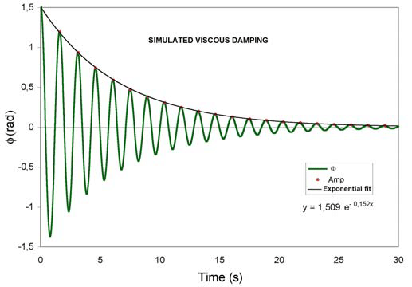
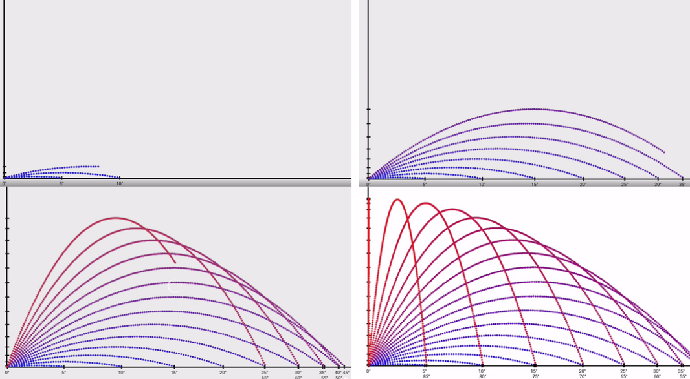

# Problem 1

# Mechanics

# Task 1
# Theoretical Foundation:

Begin by deriving the governing equations of motion from fundamental principles. This involves solving a basic differential equation to establish the general form of the motion.

Highlight how variations in initial conditions lead to a family of solutions.

## Solution
Define the Forces Acting on the Projectile
A projectile is subject to only one force (neglecting air resistance):

Gravitational force acting downward:

$$
F=mg
$$

$$
24=m6
$$

$$
m=24/6
$$

$$
m=4
$$

$$
24=4*6
$$

# Analysis of the Range:
Investigate how the horizontal range depends on the angle of projection.

Discuss how changes in other parameters, such as initial velocity and gravitational acceleration, influence the relationship.

## Explanation
The horizontal range of a projectile depends on the projection angle in a predictable way, governed by the equation:

1. Sinusoidal Relationship:

The range is proportional to sin(2θ), which means it varies in a sinusoidal pattern with the angle.

Sin(2θ) reaches its maximum value of 1 when 2θ = 90°, or θ = 45°

At 45°, the projectile travels the farthest.

As 𝜃 increases beyond 45°, sin(2𝜃) decreases, causing the range to shorten.

2. Symmetry
The range for angles that add up to 90° is the same. For example:

R(30°) = R(60°)

R(10°) = R(80°)

This is because sin(20) = sin(180° - 2θ)

Here’s the graph showing the horizontal range as a function of the projection angle! You can see the symmetric curve peaking at 45°, with key points marked at 30°, 45°, and 60° to highlight the symmetry.

## Example

$$
R=(20)^2sin(2*45°) / 9.8
$$

$$
R=400 * sin(90°) / 9.8
$$

$$
R=400 * 1 / 9.8
$$

$$
R≈40.82
$$

The projectile travels about 40.82 meters.

# Practical Applications:
Reflect on how this model can be adapted to describe various real-world situations, such as projectiles launched on uneven terrain or in the presence of air resistance.

The "Practical Applications" section is asking you to think about how the basic idea of gravitation (Newton’s law of universal gravitation) applies to real-life situations that are more complicated than the simple examples we often see in textbooks. Let’s break it down:

1. What is the Gravitation Model?

Your project already includes Newton’s law of gravitation: 

This formula tells us the force (𝐹) between two objects (with masses 𝑚1 and 𝑚2) depends on how far apart they are (𝑟) and a constant (𝐺, which is  ).

In simple physics problems, we use this to calculate things like how a ball falls straight down or how planets orbit the Sun, assuming no other forces or complications.

Parabolic Curve (Blue, Shorter Range): This represents the trajectory of a projectile (like a ball) launched at an angle, affected by gravity and likely air resistance.
Straight Line (Blue, Longer Range): This represents a different scenario, possibly a projectile on a sloped terrain (like downhill) or with a different launch condition (e.g., higher velocity or no air resistance).

Graph Details:

X-Axis: Horizontal distance traveled (in meters), ranging from 0 to 250 meters.

Y-Axis: Height (in meters), ranging from 0 to 35 meters.

Parabolic Curve: Starts at (0,0), rises to a peak around 10 meters high at about 50 meters horizontally, then falls back to the ground around 100 meters.

Straight Line: Starts at (0,0) and rises steadily, reaching about 35 meters high at 250 meters horizontally.

Interpretation:

Parabolic Curve: This is the typical path of a projectile in a vacuum or with air resistance on flat ground. Gravity pulls the projectile down, creating a curved (parabolic) trajectory. If air resistance is present, the range (horizontal distance) is reduced, which matches the shorter range (around 100 meters) seen here.

Straight Line: This doesn’t look like a typical projectile trajectory because it doesn’t curve downward. It might represent:

A projectile launched on a downhill slope, where the terrain keeps it moving farther without hitting the ground as quickly.

A simplified model (e.g., ignoring gravity’s downward pull for demonstration) or a different type of motion (like a rocket with constant upward thrust).

The slope extends the range because the projectile doesn’t hit the ground as soon—it keeps traveling downward along the hill.

Connection to Practical Applications:
Uneven Terrain: The straight line could show how a downhill slope increases the range of a projectile compared to flat ground (parabolic curve). On a downhill slope, gravity still pulls the projectile down, but the slope allows it to travel farther horizontally before landing.

Air Resistance: The parabolic curve likely includes air resistance (since its range is shorter than expected for a vacuum). Air resistance slows the projectile, reducing its range compared to an ideal scenario.

Explanation for My Project:

“This graph compares the trajectory of a projectile under two conditions. The parabolic curve (shorter range, around 100 meters) shows a projectile launched on flat ground, where gravity pulls it down and air resistance slows it, creating a typical curved path. The straight line (longer range, around 250 meters) represents a projectile launched on a downhill slope. The slope extends the range because the projectile follows the terrain, delaying its landing. This shows how uneven terrain adapts the gravitation model in real-world scenarios.”

Explanation of the Plot
This plot represents the effect of air resistance on projectile motion. It compares two scenarios:

No Air Resistance (Blue Curve)

The projectile follows an ideal parabolic trajectory.
The object reaches a higher peak and travels a longer horizontal distance.

With Air Resistance (Red Curve)

The trajectory is affected by air drag, reducing both the maximum height and horizontal range.
The projectile slows down due to resistive forces, causing it to fall earlier.