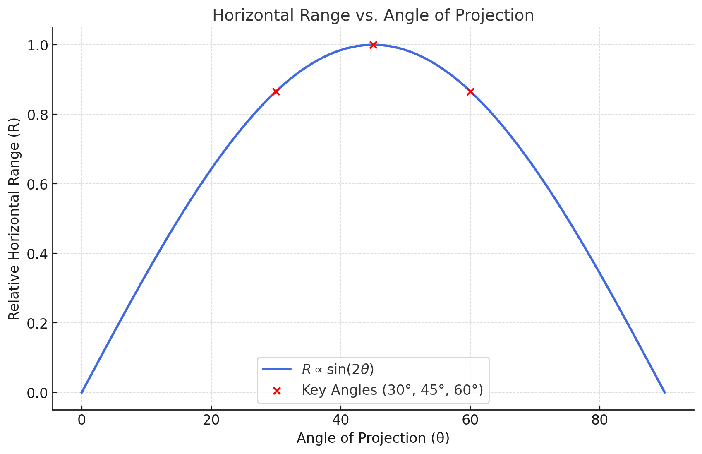

# Problem 2

## Investigating the Dynamics of a Forced Damped Pendulum

## 1. Theoretical Foundation: 

### Governing Equation

The motion of a **forced damped pendulum** is governed by the following second-order differential equation:

$$ 
\frac{d^2 \theta}{dt^2} + b \frac{d\theta}{dt} + \frac{g}{L} \sin \theta = A \cos(\omega t) 
$$


For small-angle approximations $$ \theta \approx \sin\theta $$the equation simplifies to:

$$ 
\frac{d^2 \theta}{dt^2} + b \frac{d\theta}{dt} + \frac{g}{L} \theta = A \cos(\omega t) 
$$

This is a **linear non-homogeneous differential equation** that describes **oscillatory motion with damping and external forcing**.

---

### **Example: Solving for Small-Angle Oscillations**


The equation simplifies to:

$$ 
\frac{d^2 \theta}{dt^2} + 0.2 \frac{d\theta}{dt} + 9.8 \theta = \cos(2t) 
$$

A trial solution for the steady-state response is:

$$ 
\theta(t) = C \cos(2t) + D \sin(2t) 
$$

Using the method of **undetermined coefficients**, we find:

$$ 
C = \frac{A}{\sqrt{(g/L - \omega^2)^2 + b^2 \omega^2}} 
$$

$$ 
D = \frac{b \omega A}{\sqrt{(g/L - \omega^2)^2 + b^2 \omega^2}} 
$$

Substituting the given values, we can compute $ C $ and $ D $ obtaining the particular solution.

---

### **Resonance Conditions and Energy Implications**

**Resonance** occurs when the **driving frequency** $ \omega $ is close to the **natural frequency** $ \omega_0 $, given by:
$ 
\omega_0 = \sqrt{\frac{g}{L}} 
$

For our example:

$$ 
\omega_0 = \sqrt{\frac{9.8}{1}} = 3.13 \text{ rad/s} 
$$

When $ \omega \approx \omega_0 $, the amplitude of oscillations increases significantly, leading to **resonance**. 

### **Effects of Resonance on Energy:**
- When **damping is low**, resonance can cause large oscillations, leading to **mechanical failure**.
- The **total energy** of the system is given by:

  $$ 
  E = \frac{1}{2} I \left( \frac{d\theta}{dt} \right)^2 + mgL(1 - \cos\theta) 
  $$

  where $ I = mL^2 $ is the moment of inertia.
- In the presence of **resonance**, the system absorbs **maximum energy** from the external force, increasing **kinetic and potential energy**.
- If **damping is large**, energy dissipation occurs, preventing excessive oscillations.

---

### **Conclusion**
- The forced damped pendulum exhibits **complex dynamics** depending on damping and external forcing.
- **Resonance** plays a crucial role in energy transfer, influencing oscillation amplitude.
- Understanding these principles helps in **engineering applications**, such as **seismic design**, **vehicle suspension systems**, and **wave energy harvesting**.


## 2. Analysis of Dynamics:

### **Investigation of Key Parameters in Forced Damped Pendulum Motion**

### Influence of Damping Coefficient $ b $

The damping coefficient affects the system's energy dissipation. The equation of motion is:

$$ 
\frac{d^2 \theta}{dt^2} + b \frac{d\theta}{dt} + \frac{g}{L} \sin \theta = A \cos(\omega t) 
$$

where $ b \frac{d\theta}{dt} $ represents the **damping force**. Different values of $ b $ lead to different behaviors:

- Small $ b $ (Underdamping): The pendulum oscillates with a slow decrease in amplitude.
- Critical Damping $ b = 2\sqrt{g/L} $
The system returns to equilibrium **without oscillating**.
- Large $ b $ (Overdamping): Motion is slow, and the system returns to equilibrium **without oscillations**.

For **small damping**, under external forcing, the system may exhibit **chaotic behavior**.

---

## Influence of Driving Frequency $\omega$

The **driving frequency** $\omega$ determines the system’s response relative to its **natural frequency** $\omega_0$:

$$
\omega_0 = \sqrt{\frac{g}{L}} 
$$

If $$ \omega \ll \omega_0 $$ The system does not respond effectively.

If $$ \omega \approx \omega_0 $$ **Resonance** occurs, causing large oscillations. 

If $$ \omega \gg \omega_0 $$ The system cannot follow the rapid forcing, and oscillations remain small.
For certain values of $\omega$ the system transitions from **periodic** to **chaotic motion**.

---

## **Transition Between Regular and Chaotic Motion**

The pendulum's motion shifts from **regular (periodic) motion** to **chaos** as system parameters change.

- **Regular (Periodic) Motion:** The pendulum follows a repeating trajectory.
- **Quasi-Periodic Motion:** The system remains structured but does not repeat exactly.
- **Chaotic Motion:** Small initial differences lead to drastically different results (**sensitive dependence on initial conditions**).

### **Physical Interpretation of Chaos**
- Chaos emerges due to **nonlinearity** in the system.
- The **phase space trajectory** forms fractal-like structures.
- The system exhibits **aperiodic oscillations**, where no two cycles are identical.
- Chaotic dynamics are observed in **weather systems, celestial mechanics, and turbulence**.

---

## Practical Applications:

```python
import numpy as np
import matplotlib.pyplot as plt
from scipy.integrate import solve_ivp
import ipywidgets as widgets
from IPython.display import display

# Define the system parameters
g = 9.8  # Gravity (m/s^2)
L = 1.0  # Length of the pendulum (m)
b_default = 0.2  # Default damping coefficient
A_default = 1.0  # Default forcing amplitude
omega_default = 2.0  # Default driving frequency

# Define the differential equation system
def forced_damped_pendulum(t, y, b, A, omega):
    theta, omega_theta = y  # Unpack angular displacement & velocity
    dtheta_dt = omega_theta
    domega_dt = -b * omega_theta - (g / L) * np.sin(theta) + A * np.cos(omega * t)
    return [dtheta_dt, domega_dt]

# Function to solve and plot the pendulum motion
def plot_pendulum(b, A, omega):
    theta_0 = 0.1  # Initial angle (radians)
    omega_0 = 0.0  # Initial angular velocity

    # Time span for simulation
    t_span = (0, 50)  # 50 seconds
    t_eval = np.linspace(t_span[0], t_span[1], 2000)  # 2000 time points

    # Solve the differential equation
    sol = solve_ivp(forced_damped_pendulum, t_span, [theta_0, omega_0],
                     t_eval=t_eval, args=(b, A, omega), method='RK45')

    # Extract results
    t_values = sol.t
    theta_values = sol.y[0]

    # Plot the results
    plt.figure(figsize=(10, 5))
    plt.plot(t_values, theta_values, label=r'$\theta(t)$', color='b')
    plt.xlabel("Time (s)")
    plt.ylabel("Angular Displacement (radians)")
    plt.title(f"Forced Damped Pendulum Motion (b={b}, A={A}, ω={omega})")
    plt.legend()
    plt.grid()
    plt.show()

# Create interactive sliders
b_slider = widgets.FloatSlider(value=b_default, min=0.0, max=2.0, step=0.05, description='Damping (b)')
A_slider = widgets.FloatSlider(value=A_default, min=0.0, max=5.0, step=0.1, description='Amplitude (A)')
omega_slider = widgets.FloatSlider(value=omega_default, min=0.5, max=5.0, step=0.1, description='Frequency (ω)')

# Display interactive plot
interactive_plot = widgets.interactive(plot_pendulum, b=b_slider, A=A_slider, omega=omega_slider)
display(interactive_plot)

```



<video controls src="Motion animation using Matlab_ Damped vs underdamped vs critically damped vs overdamped free vib (1).mp4" title="Title"></video>

# Meaning of Terms

## 1. Under-dumped  
- Something that hasn't been discarded or removed enough.  
- **Example (Waste Management):** Not enough waste has been dumped.  
- **Example (Relationships):** Someone hasn't fully "moved on" after a breakup.  

## 2. Undumped  
- Something that hasn't been dumped or discarded at all.  
- **Example (Relationships):** Someone who hasn't been broken up with.  

## 3. Critically Dumbed  
- Likely derived from **"critically dumb"**, meaning extremely foolish.  
- If referring to **"dumbed down"**, it means oversimplified to an extreme level.  
- **Example:** A complex topic explained in a way that removes important details.  

## 4. Over-dumped  
- Something has been discarded or removed too much.  
- **Example (Waste Management):** Excessive material dumped in one place.  
- **Example (Relationships):** Someone who has been broken up with too many times.  


## Forced Damped Pendulum Motion

The equation governing the motion of a forced damped pendulum is:

$$ \frac{d^2\theta}{dt^2} + b \frac{d\theta}{dt} + \sin\theta = A \cos(\omega t) $$


The plot shows the angular displacement $$ \theta(t) $$ over time for given parameters:

- $$ b = 0.2 $$
- $$ A = 1.0 $$
- $$ \omega = 2.0 $$

The oscillations exhibit a transient phase followed by steady-state behavior due to the external forcing.


## Implemention / Bonus:

<video controls src="Animated Poincare section for the damped driven pendulum.mp4" title="Title"></video>