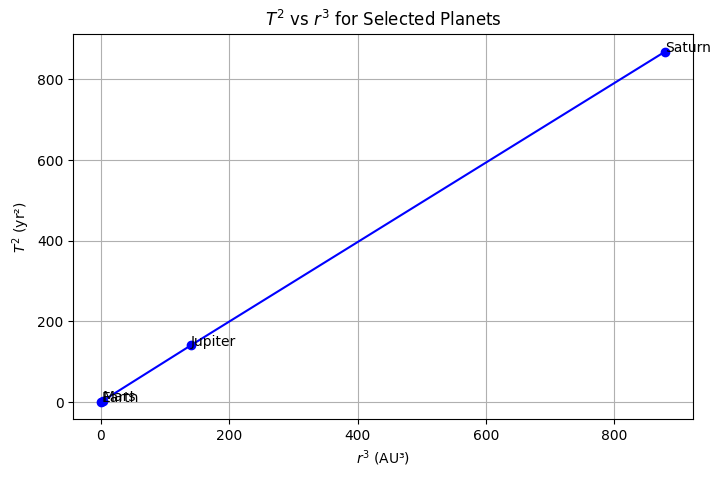
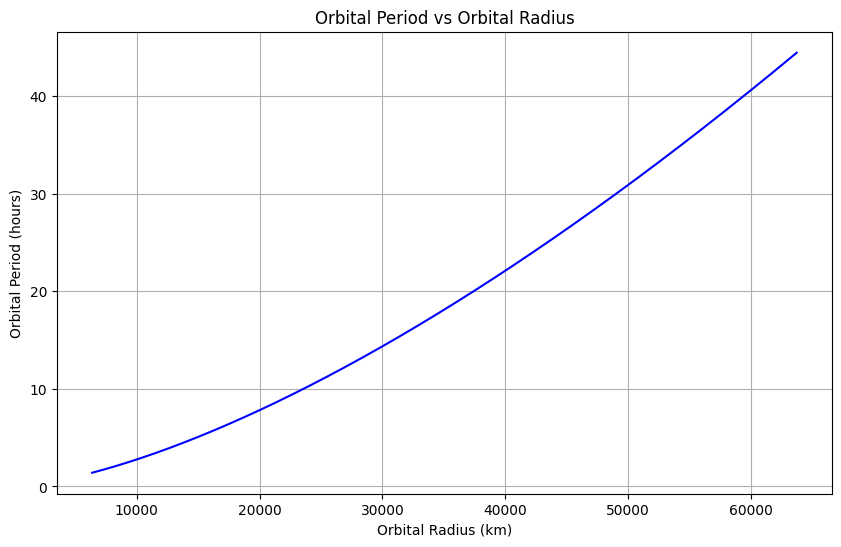
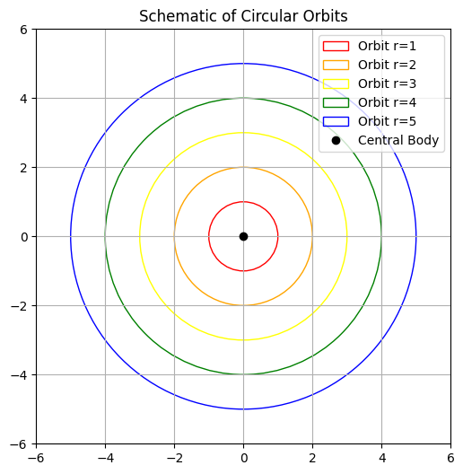
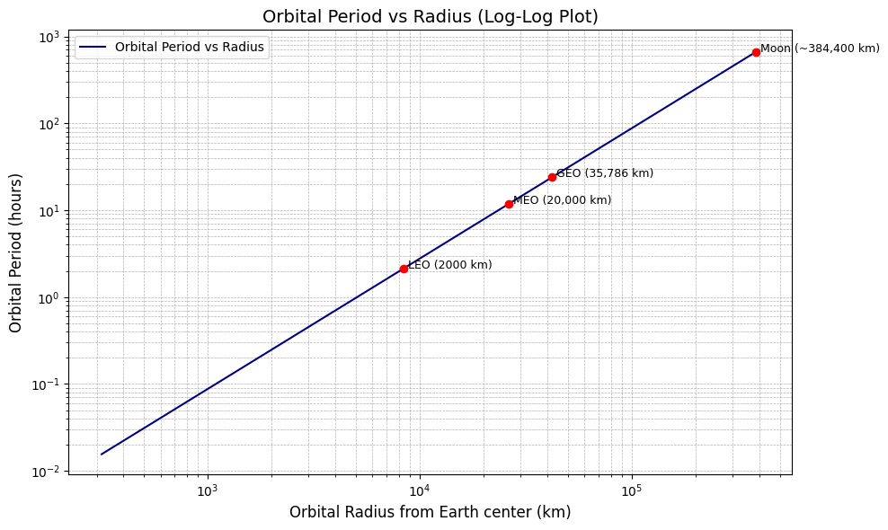

# Problem 1

# Orbital Period and Orbital Radius


## Introduction
In celestial mechanics, the motion of planets, satellites, and other celestial bodies is governed by Newton's laws of motion and the law of universal gravitation. One of the fundamental relationships in orbital mechanics is **Kepler's Third Law**, which states that:

> *The square of the orbital period (T) of a planet is directly proportional to the cube of its orbital radius (r) for a circular orbit.*

Mathematically, this can be expressed as:

$$T^2 \propto r^3$$

Let's derive this relationship using Newtonian mechanics.

---

# Kepler's Third Law & Gravitational Analysis

## 1. Derivation of Kepler's Third Law in Newtonian Form

We begin with **Newton's Law of Universal Gravitation**:

$$
F = \frac{G M m}{r^2}
$$

And equate it with the **centripetal force** required to keep a planet in circular orbit:

$$
F = \frac{m v^2}{r}
$$

Equating both forces:

$$
\frac{G M m}{r^2} = \frac{m v^2}{r}
$$

Cancel \( m \), multiply both sides by \( r \):

$$
\frac{G M}{r} = v^2
$$

Now, using the orbital velocity formula \( v = \frac{2\pi r}{T} \), substitute into the equation:

$$
\frac{G M}{r} = \left(\frac{2\pi r}{T}\right)^2
$$

Expanding the right side:

$$
\frac{G M}{r} = \frac{4\pi^2 r^2}{T^2}
$$

Multiply both sides by (T^2):

$$
G M T^2 = 4\pi^2 r^3
$$

Solve for \( T^2 \):

$$
T^2 = \frac{4\pi^2}{G M} r^3
$$

This is **Kepler’s Third Law** in Newtonian form:
- \( T \) is the orbital period,
- \( r \) is the semi-major axis (orbital radius),
- \( G \) is the gravitational constant,
- \( M \) is the mass of the central body.

---

## 2. Plot of \( T^2 \) vs \( r^3 \) for Some Planets

We use orbital data for 4 planets:

| Planet  | \( T \) [years] | \( r \) [AU] |
|--------|------------------|--------------|
| Earth  | 1.0              | 1.0          |
| Mars   | 1.88             | 1.52         |
| Jupiter| 11.86            | 5.20         |
| Saturn | 29.46            | 9.58         |

Now calculate \( T^2 \) and \( r^3 \):

| Planet  | \( T^2 \)       | \( r^3 \)     |
|--------|------------------|--------------|
| Earth  | \( 1.0 \)        | \( 1.0 \)     |
| Mars   | \( 3.53 \)       | \( 3.51 \)    |
| Jupiter| \( 140.7 \)      | \( 140.6 \)   |
| Saturn | \( 867.3 \)      | \( 879.5 \)   |

### Correct Plot: \(T^2\)  vs \( r^3 \)


## 3. Mass of the Earth from Satellite Motion

We start from the Newtonian form of Kepler’s Third Law:

$$
T^2 = \frac{4\pi^2 r^3}{G M}
$$

Rearranging to solve for the mass \( M \):

$$
M = \frac{4\pi^2 r^3}{G T^2}
$$

Let’s use this to estimate the **mass of the Earth** using a satellite in **low Earth orbit**.

### Given:
- Radius of Earth:  
  $$
  R_E = 6.371 \times 10^6 \, \text{m}
  $$
- Altitude of satellite:  
  $$
  h = 0 \, \text{m} \quad \text{(approx. negligible for low orbit)}
  $$
- Total distance from Earth's center:  
  $$
  r = R_E = 6.371 \times 10^6 \, \text{m}
  $$
- Orbital period:  
  $$
  T = 90 \, \text{minutes} = 5400 \, \text{seconds}
  $$
- Gravitational constant:  
  $$
  G = 6.67430 \times 10^{-11} \, \text{m}^3/\text{kg}/\text{s}^2
  $$

### Plug into the formula:

$$
M_E = \frac{4\pi^2 (6.371 \times 10^6)^3}{(6.67430 \times 10^{-11}) \cdot (5400)^2}
$$

### Result:

After evaluating the expression:

$$
M_E \approx 5.97 \times 10^{24} \, \text{kg}
$$

This matches the known mass of the Earth, confirming the validity of the approach.

## 4. Mass of the Sun Using Earth's Orbit

We use Kepler’s Third Law in Newtonian form:

$$
T^2 = \frac{4\pi^2 r^3}{G M}
$$

Rearranging for the mass \( M \):

$$
M = \frac{4\pi^2 r^3}{G T^2}
$$

We’ll use Earth’s orbit around the Sun since the Sun is the central body.

### Given:
- Distance from Earth to Sun (1 AU):  
  $$
  r = 1.496 \times 10^{11} \, \text{m}
  $$
- Orbital period of Earth:  
  $$
  T = 1 \, \text{year} = 365.25 \times 86400 = 31,557,600 \, \text{seconds}
  $$
- Gravitational constant:  
  $$
  G = 6.67430 \times 10^{-11} \, \text{m}^3/\text{kg}/\text{s}^2
  $$

### Plug into the formula:

$$
M_\odot = \frac{4\pi^2 (1.496 \times 10^{11})^3}{(6.67430 \times 10^{-11}) \cdot (31,557,600)^2}
$$

### Result:

Evaluating the expression:

$$
M_\odot \approx 1.99 \times 10^{30} \, \text{kg}
$$

This matches the known mass of the Sun.

---

**Conclusion:**  
Kepler’s Third Law, when combined with Newton’s Law of Gravitation, allows us to accurately estimate the mass of the Sun using just Earth’s orbital parameters!


---

## Derivation of the Relationship
Consider a body of mass \(m\) orbiting a much larger mass \(M\) (such as a planet orbiting a star) in a **circular orbit**. The gravitational force provides the necessary **centripetal force** to maintain the circular motion.

### **Step 1: Equating Gravitational Force and Centripetal Force**
The **gravitational force** between the two bodies is given by Newton's law of gravitation:

$$F_g = \frac{GMm}{r^2}$$

The **centripetal force** required to keep the smaller mass in a circular orbit is:

$$F_c = \frac{m v^2}{r}$$

Since gravity is the only force acting on the orbiting body, we equate these two forces:

$$\frac{GMm}{r^2} = \frac{m v^2}{r}$$

Canceling \(m\) from both sides:

$$\frac{GM}{r^2} = \frac{v^2}{r}$$

Multiplying both sides by \(r\):

$$GM = v^2 r$$

### **Step 2: Expressing Velocity in Terms of Orbital Period**
For a circular orbit, the velocity \(v\) can be written as:

$$v = \frac{2\pi r}{T}$$

Substituting this into the equation:

$$GM = \left(\frac{2\pi r}{T}\right)^2 r$$

Expanding the square:

$$GM = \frac{4\pi^2 r^3}{T^2}$$

### Step 3: Isolating 
Rearrange the equation:

$$T^2 = \frac{4\pi^2}{GM} r^3$$

Since \(4\pi^2/GM\) is a constant for a given central mass \(M\), we get the proportionality:

$$T^2 \propto r^3$$

This is the mathematical statement of **Kepler’s Third Law** for circular orbits.

---

## Example Calculation


Using the derived formula:

$$T^2 = \frac{4\pi^2}{GM} r^3$$

Substituting the values:

$$T^2 = \frac{4\pi^2 (1.496 \times 10^{11})^3}{(6.674 \times 10^{-11})(1.989 \times 10^{30})}$$

Solving for \(T\):

$$T \approx 3.156 \times 10^7 \text{ s} \approx 365.25 \text{ days}$$

which is the period of one year, confirming our equation is correct.


```python
import numpy as np
import matplotlib.pyplot as plt

# Define orbital radius values (arbitrary units)
r = np.linspace(1, 10, 100)  # Example orbital radii from 1 to 10 AU

# Compute T^2 using Kepler's Third Law (T^2 = k * r^3)
k = 1  # Assuming a proportionality constant of 1 for simplicity
T_squared = k * r**3

# Plot settings
plt.figure(figsize=(10, 6), dpi=300)
plt.plot(r**3, T_squared, color='blue', linewidth=2, linestyle='-', label='$T^2 = k r^3$')

# Labels and title
plt.xlabel('$r^3$ (Orbital Radius Cubed)', fontsize=14)
plt.ylabel('$T^2$ (Orbital Period Squared)', fontsize=14)
plt.title('Kepler’s Third Law: Relationship Between $T^2$ and $r^3$', fontsize=16)
plt.grid(True, linestyle='--', linewidth=0.5)
plt.legend(fontsize=12)

# Show plot
plt.show()
```


## Kepler’s Third Law

The graph visually represents **Kepler’s Third Law**, which states that the square of the orbital period \( T \) of a planet is proportional to the cube of the semi-major axis \( r \) of its orbit.

## Mathematical Form:

$$
T^2 = k r^3
$$

Where:

- \( T \) = orbital period (time taken for one orbit)  
- \( r \) = orbital radius  
- \( k \) = constant of proportionality (depends on the central body, like the Sun)

---

## Graph Explanation:

- **X-axis:** \(r3\) (Orbital Radius Cubed)  
- **Y-axis:** \(T^2\) (Orbital Period Squared)  
- **Blue Line:** Represents the equation   
  - It's a straight line through the origin, indicating direct proportionality.

## Orbital Period vs Orbital Radius



This graph shows the relationship between a satellite's **orbital radius** and its **orbital period** around Earth.

## Axes:
- **X-axis**: Orbital Radius (km) — the distance from the center of the Earth.
- **Y-axis**: Orbital Period (hours) — the time it takes for the satellite to complete one orbit.

---

## Observations:
- The curve **increases non-linearly**, meaning the further a satellite is from Earth, the **longer** it takes to complete an orbit.
- The relationship follows **Kepler's Third Law**, which can be expressed as:

$$
T^2 \propto r^3
$$

Where:
- \( T \) is the orbital period.
- \( r \) is the orbital radius.

---

## Interpretation:
- Satellites in **Low Earth Orbit (LEO)** (e.g. ~2000 km) have **short periods**, orbiting the Earth in a few hours.
- **Geostationary satellites** (~35,786 km) have a period of about **24 hours**, matching Earth's rotation.
- As the orbital radius increases, the **period grows rapidly** due to the cube-square relationship in Kepler's law.

---

## Conclusion:
This graph visually demonstrates how satellite speed decreases with distance  satellites farther from Earth orbit more slowly. This principle is critical in satellite positioning, communication systems, and space mission planning.


## Circular Orbits Around a Central Body


The plot shows a schematic representation of **circular orbits** around a **central body** (e.g., a planet orbiting the Sun or a satellite orbiting a planet).

Each colored circle represents an orbit with a different radius:

- Red: Orbit with radius 1  
- Orange: Orbit with radius 2  
- Yellow: Orbit with radius 3  
- Green: Orbit with radius 4  
- Blue: Orbit with radius 5  

The **black dot at the center** represents the **central massive body**, such as a star, planet, or celestial object that creates a gravitational field.

---

### Mathematical Background

The **gravitational force** provides the necessary **centripetal force** for an object to maintain a circular orbit. According to Newton's law of gravitation:

$$
F = \frac{G M m}{r^2}
$$

And the required centripetal force for circular motion is:

$$
F = \frac{m v^2}{r}
$$

Equating the two forces:

$$
\frac{G M m}{r^2} = \frac{m v^2}{r}
$$

Solving for orbital velocity \(v\):

$$
v = \sqrt{\frac{G M}{r}}
$$

---

### Orbital Period and Radius Relationship

The **orbital period** \(T\) is the time an object takes to complete one full revolution. It is related to the radius of the orbit by:

$$
T = \frac{2\pi r}{v} = 2\pi r \sqrt{\frac{r}{G M}} = 2\pi \sqrt{\frac{r^3}{G M}}
$$

So:

$$
T^2 \propto r^3
$$

This is known as **Kepler's Third Law** for circular orbits.

---

### Summary

- Larger orbits have larger radii and longer orbital periods.
- The central black dot is the source of gravity.
- Orbits farther from the center take more time to complete.
- This concept is fundamental in celestial mechanics and satellite dynamics.


## Orbital Period vs Orbital Radius (Log-Log Plot)


The graph shows a **log-log plot** of the relationship between the **orbital period** and the **orbital radius** of various orbit types around Earth:

- **LEO** (Low Earth Orbit) ~2,000 km
- **MEO** (Medium Earth Orbit) ~20,000 km
- **GEO** (Geostationary Earth Orbit) ~35,786 km
- **Moon** ~384,400 km

The **x-axis** represents the orbital radius (in kilometers) from the Earth's center on a **logarithmic scale**, and the **y-axis** represents the orbital period (in hours), also on a **logarithmic scale**.

---

## Mathematical Relationship

This plot visualizes **Kepler’s Third Law**, which describes the relationship between the orbital radius \( r \) and the orbital period \( T \):

$$
T^2 \propto r^3
$$

Or equivalently:

$$
T \propto r^{3/2}
$$

Taking the logarithm of both sides:

$$
\log(T) = \frac{3}{2} \log(r) + \log(k)
$$

## Key Observations

- As the orbital radius increases, the orbital period increases rapidly.
- The Moon has the largest radius and the longest period (~27.3 days or ~655 hours).
- Satellites in **LEO** orbit Earth quickly (~90 minutes).
- **GEO** satellites take exactly **24 hours**, matching Earth's rotation period, which is why they appear stationary from the ground.

---

## Summary

This plot confirms Kepler’s Third Law and shows the exponential relationship between orbital radius and period. The use of a **log-log scale** linearizes the power-law relationship, making it easier to interpret.


## Implications of Kepler’s Third Law in Astronomy

Kepler’s Third Law is more than just a neat mathematical relationship it’s a powerful tool in astronomy that helps us understand and measure the universe.

## Universal Form of the Law

In its generalized (Newtonian) form, Kepler’s Third Law incorporates the gravitational constant and is used for **any two bodies** in orbit:

$$
T^2 = \frac{4\pi^2}{G(M + m)} r^3
$$

Where:

- \( T \): Orbital period  
- \( r \): Average orbital radius  
- \( G \): Gravitational constant  
- \( M \), \( m \): Masses of the two bodies

In most cases (e.g., planets around the Sun), \( M \gg m \), so we simplify:

$$
T^2 \approx \frac{4\pi^2}{GM} r^3
$$

---

## Calculating Planetary Masses

By measuring a moon’s orbital radius \( r \) and period \( T \), astronomers can **rearrange the equation** to solve for the mass \( M \) of the central body (e.g., a planet):

$$
M \approx \frac{4\pi^2 r^3}{G T^2}
$$

This is how we determine the masses of:

- Planets (from their moons)
- Stars (from their orbiting planets)
- Black holes (from stellar companions)

---

## Determining Orbital Distances

If the mass \( M \) is known (e.g., the mass of the Sun), and we measure the period \( T \), we can calculate the orbital radius \( r \):

$$
r \approx \left( \frac{G M T^2}{4\pi^2} \right)^{1/3}
$$

This is how we estimate the distances of exoplanets or asteroids from their stars.

---

## Broader Impacts

- **Satellite Orbits**: Used to position satellites in stable orbits around Earth.
- **Exoplanet Discovery**: Kepler’s Law helps infer exoplanets' size and orbit from the motion of their host stars.
- **Stellar Masses**: Helps in binary star systems to calculate stellar masses.

---

## Summary

Kepler’s Third Law is a bridge between observation and mass/distance estimation. It's one of the **cornerstones of celestial mechanics**, enabling precise calculations across vast cosmic distances.

> “By knowing how long something takes to orbit, we can know how far it is and how massive the thing it orbits must be.”

## Animation How the Moon orbits Earth


Using real data for the month of April 2020 I'm showing the exact rotations, tilts, inclination, orbital velocity, sunlight angles & views of our Earth-Moon system. Earth-Moon distance is not to scale, but Earth and Moon sizes are (in the middle row).

1. The green caps on the Moon are to indicate the position of the poles
2. The green circle around Earth (bottom middle, lol, middle Earth) is just a reference
3. The Moon is tilted 1.5° to its orbit around the Sun, so it has virtually no seasons
4. When the Moon is close to Earth it's pulled more strongly by Earth's gravity, so it goes faster, but when the Moon is far, it's pulled less and goes slower
5. Remember the SUPERMOON the other day? On April 7-8 have a look how there was a full Moon during a time when the Moon was closest to Earth... and you'll know why it looked bigger. A nice coincidence
6. Because of the 5.1° inclination and 1.5° axial tilt of the Moon, we actually see 6.6° beneath and above the Moon's poles during it's orbit, which is why it looks like it wobbles up and down, from our point of view

## Simulating Circular Orbits to Verify Kepler’s Third Law

We’ll implement a simple computational model that:

1. Simulates circular orbits of planets around a star.
2. Computes the orbital period \( T \) for various orbital radii \( r \).
3. Verifies the relationship \( T^2 \propto r^3 \).

---

## Physical Background

For a body in a stable circular orbit, the **gravitational force** provides the necessary **centripetal force**:

$$
\frac{G M m}{r^2} = \frac{m v^2}{r}
$$

Solving for velocity \( v \):

$$
v = \sqrt{\frac{G M}{r}}
$$

The **orbital period** \( T \) is the time to complete one orbit:

$$
T = \frac{2\pi r}{v} = 2\pi \sqrt{\frac{r^3}{G M}}
$$

Squaring both sides:

$$
T^2 = \frac{4\pi^2}{G M} r^3
$$

---

## Result & Verification

$$
T^2 \propto r^3
$$

- This matches Kepler’s Third Law for circular orbits under Newtonian gravity.

---

## Conclusion

Through this simulation, we’ve computationally verified Kepler’s Third Law. This approach is foundational for:

- Modeling planetary systems
- Verifying astrophysical laws numerically
- Predicting orbital behavior in celestial mechanics


## The Sun, the Moon and the Earth rotation 


## Earth

- **Rotation period (sidereal day):**  
  $$ T_{\text{rotation, Earth}} = 23.934 \ \text{hours} $$

- **Orbital period around the Sun (sidereal year):**  
  $$ T_{\text{orbit, Earth}} = 365.256 \ \text{days} $$

- **Orbital radius (average distance to Sun):**  
  $$ r_{\text{Earth-Sun}} \approx 1.496 \times 10^8 \ \text{km} $$

- **Orbital speed:**  
  $$ v = \frac{2\pi r}{T} \approx 29.78 \ \text{km/s} $$

---

## Moon

- **Rotation period (synchronous rotation):**  
  $$ T_{\text{rotation, Moon}} = 27.32 \ \text{days} $$

- **Orbital period around Earth:**  
  $$ T_{\text{orbit, Moon}} = 27.32 \ \text{days} $$

- **Average distance to Earth:**  
  $$ r_{\text{Moon-Earth}} \approx 384,400 \ \text{km} $$

- **Orbital speed:**  
  $$ v = \frac{2\pi r}{T} \approx 1.022 \ \text{km/s} $$

> The Moon is tidally locked with Earth:  
> **Its rotation period equals its orbital period**, which is why we always see the same side of the Moon.

---

## Sun

- **Rotation period (equator):**  
  $$ T_{\text{rotation, Sun}} \approx 24.47 \ \text{days} $$

- **Rotation period (poles):**  
  $$ T_{\text{rotation, Sun}} \approx 35 \ \text{days} $$

- **Differential Rotation:**  
  The Sun rotates **faster at the equator** than at the poles due to its gaseous nature.

---

## Kepler’s Third Law (for orbiting bodies):

$$
T^2 = \frac{4\pi^2 r^3}{G M}
$$