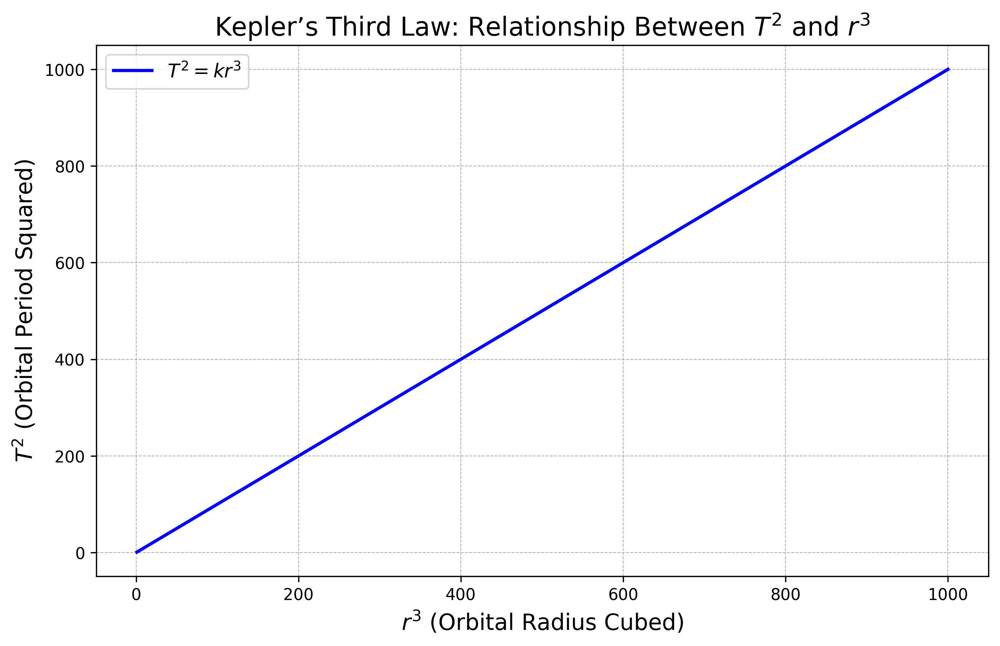

# Problem 1

# Orbital Period and Orbital Radius


## Introduction
In celestial mechanics, the motion of planets, satellites, and other celestial bodies is governed by Newton's laws of motion and the law of universal gravitation. One of the fundamental relationships in orbital mechanics is **Kepler's Third Law**, which states that:

> *The square of the orbital period (T) of a planet is directly proportional to the cube of its orbital radius (r) for a circular orbit.*

Mathematically, this can be expressed as:

$$T^2 \propto r^3$$

Let's derive this relationship using Newtonian mechanics.

---

## Derivation of the Relationship
Consider a body of mass \(m\) orbiting a much larger mass \(M\) (such as a planet orbiting a star) in a **circular orbit**. The gravitational force provides the necessary **centripetal force** to maintain the circular motion.

### **Step 1: Equating Gravitational Force and Centripetal Force**
The **gravitational force** between the two bodies is given by Newton's law of gravitation:

$$F_g = \frac{GMm}{r^2}$$

The **centripetal force** required to keep the smaller mass in a circular orbit is:

$$F_c = \frac{m v^2}{r}$$

Since gravity is the only force acting on the orbiting body, we equate these two forces:

$$\frac{GMm}{r^2} = \frac{m v^2}{r}$$

Canceling \(m\) from both sides:

$$\frac{GM}{r^2} = \frac{v^2}{r}$$

Multiplying both sides by \(r\):

$$GM = v^2 r$$

### **Step 2: Expressing Velocity in Terms of Orbital Period**
For a circular orbit, the velocity \(v\) can be written as:

$$v = \frac{2\pi r}{T}$$

Substituting this into the equation:

$$GM = \left(\frac{2\pi r}{T}\right)^2 r$$

Expanding the square:

$$GM = \frac{4\pi^2 r^3}{T^2}$$

### Step 3: Isolating 
Rearrange the equation:

$$T^2 = \frac{4\pi^2}{GM} r^3$$

Since \(4\pi^2/GM\) is a constant for a given central mass \(M\), we get the proportionality:

$$T^2 \propto r^3$$

This is the mathematical statement of **Kepler’s Third Law** for circular orbits.

---

## Example Calculation


Using the derived formula:

$$T^2 = \frac{4\pi^2}{GM} r^3$$

Substituting the values:

$$T^2 = \frac{4\pi^2 (1.496 \times 10^{11})^3}{(6.674 \times 10^{-11})(1.989 \times 10^{30})}$$

Solving for \(T\):

$$T \approx 3.156 \times 10^7 \text{ s} \approx 365.25 \text{ days}$$

which is the period of one year, confirming our equation is correct.


```python
import numpy as np
import matplotlib.pyplot as plt

# Define orbital radius values (arbitrary units)
r = np.linspace(1, 10, 100)  # Example orbital radii from 1 to 10 AU

# Compute T^2 using Kepler's Third Law (T^2 = k * r^3)
k = 1  # Assuming a proportionality constant of 1 for simplicity
T_squared = k * r**3

# Plot settings
plt.figure(figsize=(10, 6), dpi=300)
plt.plot(r**3, T_squared, color='blue', linewidth=2, linestyle='-', label='$T^2 = k r^3$')

# Labels and title
plt.xlabel('$r^3$ (Orbital Radius Cubed)', fontsize=14)
plt.ylabel('$T^2$ (Orbital Period Squared)', fontsize=14)
plt.title('Kepler’s Third Law: Relationship Between $T^2$ and $r^3$', fontsize=16)
plt.grid(True, linestyle='--', linewidth=0.5)
plt.legend(fontsize=12)

# Show plot
plt.show()
```


## Kepler’s Third Law: Relationship Between T and r

The graph visually represents **Kepler’s Third Law**, which states that the square of the orbital period \( T \) of a planet is proportional to the cube of the semi-major axis \( r \) of its orbit.

## Mathematical Form:

$$
T^2 = k r^3
$$

Where:

- \( T \) = orbital period (time taken for one orbit)  
- \( r \) = orbital radius  
- \( k \) = constant of proportionality (depends on the central body, like the Sun)

---

## Graph Explanation:

- **X-axis:** \(r3\) (Orbital Radius Cubed)  
- **Y-axis:** \(T^2\) (Orbital Period Squared)  
- **Blue Line:** Represents the equation \( T^2 = k r^3 \)  
  - It's a straight line through the origin, indicating direct proportionality.

---


# Implications of Kepler’s Third Law in Astronomy

Kepler’s Third Law is more than just a neat mathematical relationship it’s a powerful tool in astronomy that helps us understand and measure the universe.

## Universal Form of the Law

In its generalized (Newtonian) form, Kepler’s Third Law incorporates the gravitational constant and is used for **any two bodies** in orbit:

$$
T^2 = \frac{4\pi^2}{G(M + m)} r^3
$$

Where:

- \( T \): Orbital period  
- \( r \): Average orbital radius  
- \( G \): Gravitational constant  
- \( M \), \( m \): Masses of the two bodies

In most cases (e.g., planets around the Sun), \( M \gg m \), so we simplify:

$$
T^2 \approx \frac{4\pi^2}{GM} r^3
$$

---

## Calculating Planetary Masses

By measuring a moon’s orbital radius \( r \) and period \( T \), astronomers can **rearrange the equation** to solve for the mass \( M \) of the central body (e.g., a planet):

$$
M \approx \frac{4\pi^2 r^3}{G T^2}
$$

This is how we determine the masses of:

- Planets (from their moons)
- Stars (from their orbiting planets)
- Black holes (from stellar companions)

---

## Determining Orbital Distances

If the mass \( M \) is known (e.g., the mass of the Sun), and we measure the period \( T \), we can calculate the orbital radius \( r \):

$$
r \approx \left( \frac{G M T^2}{4\pi^2} \right)^{1/3}
$$

This is how we estimate the distances of exoplanets or asteroids from their stars.

---

## Broader Impacts

- **Satellite Orbits**: Used to position satellites in stable orbits around Earth.
- **Exoplanet Discovery**: Kepler’s Law helps infer exoplanets' size and orbit from the motion of their host stars.
- **Stellar Masses**: Helps in binary star systems to calculate stellar masses.

---

## Summary

Kepler’s Third Law is a bridge between observation and mass/distance estimation. It's one of the **cornerstones of celestial mechanics**, enabling precise calculations across vast cosmic distances.

> “By knowing how long something takes to orbit, we can know how far it is and how massive the thing it orbits must be.”

## Animation How the Moon orbits Earth


Using real data for the month of April 2020 I'm showing the exact rotations, tilts, inclination, orbital velocity, sunlight angles & views of our Earth-Moon system. Earth-Moon distance is not to scale, but Earth and Moon sizes are (in the middle row).

1. The green caps on the Moon are to indicate the position of the poles
2. The green circle around Earth (bottom middle, lol, middle Earth) is just a reference
3. The Moon is tilted 1.5° to its orbit around the Sun, so it has virtually no seasons
4. When the Moon is close to Earth it's pulled more strongly by Earth's gravity, so it goes faster, but when the Moon is far, it's pulled less and goes slower
5. Remember the SUPERMOON the other day? On April 7-8 have a look how there was a full Moon during a time when the Moon was closest to Earth... and you'll know why it looked bigger. A nice coincidence
6. Because of the 5.1° inclination and 1.5° axial tilt of the Moon, we actually see 6.6° beneath and above the Moon's poles during it's orbit, which is why it looks like it wobbles up and down, from our point of view

## Simulating Circular Orbits to Verify Kepler’s Third Law

We’ll implement a simple computational model that:

1. Simulates circular orbits of planets around a star.
2. Computes the orbital period \( T \) for various orbital radii \( r \).
3. Verifies the relationship \( T^2 \propto r^3 \).

---

## Physical Background

For a body in a stable circular orbit, the **gravitational force** provides the necessary **centripetal force**:

$$
\frac{G M m}{r^2} = \frac{m v^2}{r}
$$

Solving for velocity \( v \):

$$
v = \sqrt{\frac{G M}{r}}
$$

The **orbital period** \( T \) is the time to complete one orbit:

$$
T = \frac{2\pi r}{v} = 2\pi \sqrt{\frac{r^3}{G M}}
$$

Squaring both sides:

$$
T^2 = \frac{4\pi^2}{G M} r^3
$$

---

## Result & Verification

$$
T^2 \propto r^3
$$

- This matches Kepler’s Third Law for circular orbits under Newtonian gravity.

---

## Conclusion

Through this simulation, we’ve computationally verified Kepler’s Third Law. This approach is foundational for:

- Modeling planetary systems
- Verifying astrophysical laws numerically
- Predicting orbital behavior in celestial mechanics


## The Sun, the Moon and the Earth rotation 

