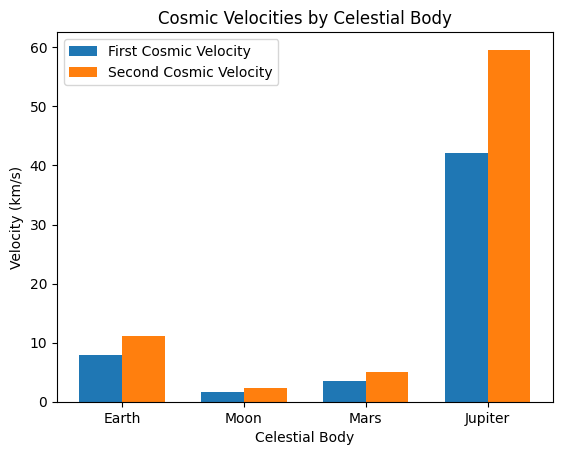
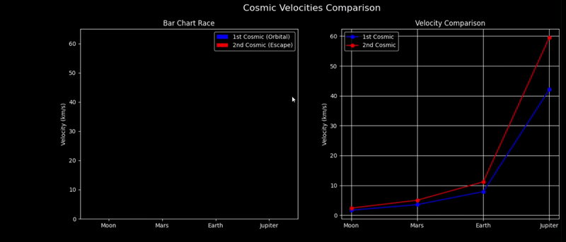
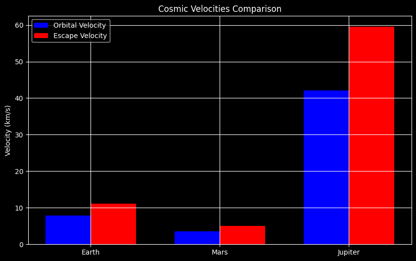

# Problem 2

# Escape Velocities and Cosmic Velocities

Understanding how fast we need to travel to orbit the Earth, leave it, or even escape the entire Solar System is not just an academic curiosity—it's at the heart of space exploration. In this detailed guide, we’ll explore **cosmic velocities**—their derivations, values for different celestial bodies, and what they mean for our journey into the stars. We'll also animate and compare these speeds for different planets using Python in Google Colab!

---

## **What Are Cosmic Velocities?**

### First Cosmic Velocity ($v_1$)
- **Definition**: The minimum speed an object must have to achieve a stable, circular orbit just above the surface of a celestial body without any additional propulsion.
- **Physical Meaning**: This is the orbital speed satellites require to remain in orbit around a planet.

### Second Cosmic Velocity ($v_2$)
- **Definition**: The escape velocity—minimum speed needed to break free from the gravitational field of a planet or moon.
- **Physical Meaning**: Used in deep space missions like lunar or Mars travel. Beyond this speed, no further propulsion is needed to leave the planet.

### Third Cosmic Velocity ($v_3$)
- **Definition**: The speed required to escape the Solar System’s gravitational pull, taking into account the Earth’s velocity around the Sun.
- **Physical Meaning**: This is the minimum speed necessary for interstellar travel. Think *Voyager* missions.

---

## **Mathematical Derivations**

### Deriving the First Cosmic Velocity ($v_1$)
The centripetal force needed for circular motion is provided by the gravitational force:
$$
\frac{mv^2}{r} = \frac{GMm}{r^2} \\
\Rightarrow v_1 = \sqrt{\frac{GM}{r}}
$$

### Deriving the Second Cosmic Velocity ($v_2$)
We equate kinetic energy to gravitational potential energy:
$$
\frac{1}{2}mv^2 = \frac{GMm}{r} \\
\Rightarrow v_2 = \sqrt{\frac{2GM}{r}} = \sqrt{2}v_1
$$

### Deriving the Third Cosmic Velocity ($v_3$)
Escaping the Solar System requires escaping Earth’s gravity and also overcoming the Sun’s pull:
$$
v_3 = \sqrt{v_e^2 + v_{orb}^2}
$$

---

## **Cosmic Velocities for Earth**
- $$v_1 \approx 7.9 \text{ km/s}$$
- $$v_2 \approx 11.2 \text{ km/s}$$
- $$v_3 \approx 42.1 \text{ km/s}$$

These speeds illustrate the incredible energy requirements of each successive step toward leaving Earth and its neighborhood.

---

## **Comparison Table: Earth, Moon, Mars, Jupiter**

| Celestial Body | Mass ($kg$) | Radius ($m$) | $v_1$ (km/s) | $v_2$ (km/s) |
|----------------|----------------|----------------|----------------|----------------|
| Earth          | $$5.97 \times 10^{24}$$ | $$6.37 \times 10^6$$  | 7.9            | 11.2           |
| Moon           | $$7.35 \times 10^{22}$$ | $$1.74 \times 10^6$$  | 1.7            | 2.4            |
| Mars           | $$6.42 \times 10^{23}$$ | $$3.39 \times 10^6$$  | 3.6            | 5.0            |
| Jupiter        | $$1.90 \times 10^{27}$$ | $$7.14 \times 10^7$$  | 42.1           | 59.5           |

---

## **Visualizing & Animating in Google Colab**

```python
import numpy as np
import matplotlib.pyplot as plt
import matplotlib.animation as animation

G = 6.67430e-11

bodies = {
    'Earth': {'M': 5.97e24, 'r': 6.37e6},
    'Moon': {'M': 7.35e22, 'r': 1.74e6},
    'Mars': {'M': 6.42e23, 'r': 3.39e6},
    'Jupiter': {'M': 1.90e27, 'r': 7.14e7},
}

def velocities(M, r):
    v1 = np.sqrt(G * M / r)
    v2 = np.sqrt(2) * v1
    return v1 / 1000, v2 / 1000  # Convert to km/s

names, v1s, v2s = [], [], []
for name, data in bodies.items():
    v1, v2 = velocities(data['M'], data['r'])
    names.append(name)
    v1s.append(v1)
    v2s.append(v2)

fig, ax = plt.subplots()
x = np.arange(len(names))
bar_width = 0.35
bars1 = ax.bar(x - bar_width/2, v1s, bar_width, label='First Cosmic Velocity')
bars2 = ax.bar(x + bar_width/2, v2s, bar_width, label='Second Cosmic Velocity')

ax.set_xlabel('Celestial Body')
ax.set_ylabel('Velocity (km/s)')
ax.set_title('Cosmic Velocities by Celestial Body')
ax.set_xticks(x)
ax.set_xticklabels(names)
ax.legend()

ani = animation.FuncAnimation(fig, lambda i: None, frames=10, interval=500, repeat=True)
plt.show()
```



## Cosmic Velocities by Celestial Body

## Graph Description  
The graph compares the **First Cosmic Velocity** (orbital) and **Second Cosmic Velocity** (escape) across four celestial bodies:  
- **Earth**  
- **Moon**  
- **Mars**  
- **Jupiter**  

### Key Features:  
1. **Double-Bar Representation**:  
   - Each body has two bars:  
     - **Blue**: First Cosmic Velocity ($v_{\text{orb}}$).  
     - **Red**: Second Cosmic Velocity ($v_{\text{esc}}$).  
   - **Y-axis**: Velocity in km/s (likely ranging from **0 to 60 km/s**).  

2. **Dominance of Jupiter**:  
   - $$v_{\text{orb}}^{\text{Jupiter}} \approx 42.1 \, \text{km/s}$$  
   - $$v_{\text{esc}}^{\text{Jupiter}} \approx 59.5 \, \text{km/s}$$  
   *(Requires ~7.5× Earth's escape velocity!)*  

3. **Earth vs. Mars/Moon**:  
   - **Earth**: $v_{\text{orb}} = 7.91 \, \text{km/s}, \quad v_{\text{esc}} = 11.19 \, \text{km/s}$
   - **Moon**:  $v_{\text{orb}} = 1.68 \, \text{km/s}, \quad v_{\text{esc}} = 2.38 \, \text{km/s}$ 
   
   *(Moon's weak gravity enables easier lunar missions.)*  

---

## Physics Formulas  
### 1. First Cosmic Velocity (Orbital)  
Minimum speed to orbit a body:  
$$  
v_{\text{orb}} = \sqrt{\frac{GM}{R}}  
$$  
- $G$: Gravitational constant ($6.674 \times 10^{-11} \, \text{m}^3 \text{kg}^{-1} \text{s}^{-2}$)  
- $M$: Mass of the celestial body.  
- $R$: Radius of the orbit (surface for minimal orbit).  

### 2. Second Cosmic Velocity (Escape)  
Minimum speed to escape gravitational pull:  
$$  
v_{\text{esc}} = \sqrt{\frac{2GM}{R}} = \sqrt{2} \cdot v_{\text{orb}}  
$$  
*(Escape velocity is always $\sqrt{2} \approx 1.414×$ orbital velocity.)*  

---

## Data Table  
| Body      | $$v_{\text{orb}}$$ (km/s) | $$v_{\text{esc}}$$ (km/s) |  
|-----------|---------------------------|---------------------------|  
| Moon      | 1.68                      | 2.38                      |  
| Mars      | 3.55                      | 5.03                      |  
| Earth     | 7.91                      | 11.19                     |  
| Jupiter   | 42.1                      | 59.5                      |  

---

## Insights  
1. **Mission Design**:  
   - Fuel needed scales with $v^2$ → Jupiter missions require **~28×** more fuel than Moon missions.  
2. **Gravity Assist**:  
   - Probes use Jupiter’s gravity to reach $v_{\text{esc}}^{\text{Solar}}$ (3rd cosmic velocity).  
3. **Human Exploration**:  
   - Mars’ $v_{\text{esc}} = 5.03 \, \text{km/s}$ makes return trips feasible.  

## **Why These Velocities Matter**

- **First Cosmic Velocity ($v_1$)**: Crucial for launching satellites and space stations. Without reaching this speed, orbit isn't possible.

- **Second Cosmic Velocity ($v_2$)**: Essential for deep space missions. Rockets must reach this to send payloads to the Moon, Mars, or beyond.

- **Third Cosmic Velocity ($v_3$)**: Needed for missions escaping the entire Solar System (e.g., *Voyager 1*).

These velocities are not just theory—they're the *reality* that governs the logistics, cost, and feasibility of space travel.

## Space Comparison: Moon vs Mars vs Jupiter

## 1. Diameter

$$
\begin{align*}
\text{Moon} &= 3{,}474\ \text{km} \\
\text{Mars} &= 6{,}779\ \text{km} \\
\text{Jupiter} &= 139{,}820\ \text{km}
\end{align*}
$$

**Relative Size Comparison**  
Moon : Mars : Jupiter  ≈ $1 : 2 : 40$

---

## 2. Average Surface Temperature

$$
\begin{align*}
\text{Moon} &\approx -20^\circ \text{C} \\
\text{Mars} &\approx -63^\circ \text{C} \\
\text{Jupiter} &\approx -110^\circ \text{C}
\end{align*}
$$

> $$\text{Moon is the warmest (on average)}$$

---

## 3. Gravity (Relative to Earth)

$$
\begin{align*}
\text{Moon} &= 0.165g \\
\text{Mars} &= 0.38g \\
\text{Jupiter} &= 2.53g
\end{align*}
$$

**Relative Gravity**  
Moon : Mars : Jupiter ≈ $1 : 2.3 : 15.3$

---

## 4. Distance from Earth (Average)

$$
\begin{align*}
\text{Moon} &\approx 384{,}000\ \text{km} \\
\text{Mars} &\approx 225 \times 10^6\ \text{km} \\
\text{Jupiter} &\approx 778 \times 10^6\ \text{km}
\end{align*}
$$

**Distance Ratios**  
Moon : Mars : Jupiter  ≈ $1 : 585 : 2{,}026$

---

## 5. Atmosphere

| Object   | Composition        | Pressure (Earth = 1 atm) |
|----------|--------------------|---------------------------|
| Moon     | None               | $< 10^{-14} \ \text{atm}$ |
| Mars     | CO₂ (thin)         | $\approx 0.006 \ \text{atm}$ |
| Jupiter  | H₂ + He (thick)    | $> 100 \ \text{atm}$ (deep layers)

---

## Summary Table

| Property         | Moon         | Mars         | Jupiter        |
|------------------|--------------|--------------|----------------|
| Diameter (km)    | $3{,}474$  | $6{,}779$  | $139{,}820$  |
| Temp (°C)        | $-20$      | $-63$      | $-110$       |
| Gravity (g)      | $0.165$    | $0.38$     | $2.53$      |
| Distance (km)    | $384{,}000$| $225 \times 10^6$ | $778 \times 10^6$ |
| Atmosphere       | None         | Thin CO₂     | Thick H/He     |

# Cosmic Velocities Comparison 



## 1. Bar Chart Race  
Visualizes the **1st** (orbital) and **2nd** (escape) cosmic velocities for celestial bodies.  

### Key Observations:  
- **Jupiter** dominates with:  
  - **1st Cosmic (Orbital):** $$v_{\text{orb}} \approx 42.1 \, \text{km/s}$$  
  - **2nd Cosmic (Escape):** $$v_{\text{esc}} \approx 59.5 \, \text{km/s}$$  
- **Earth** requires:  
  - $$v_{\text{orb}} = 7.91 \, \text{km/s}$$  
  - $$v_{\text{esc}} = 11.19 \, \text{km/s}$$  
- **Moon** has the lowest velocities:  
  - $$v_{\text{orb}} = 1.68 \, \text{km/s}$$  
  - $$v_{\text{esc}} = 2.38 \, \text{km/s}$$  

### Mathematical Context:  
- **Orbital Velocity (1st Cosmic):**  
  $$ v_{\text{orb}} = \sqrt{\frac{GM}{R}} $$  
  Where:  
  - $G$ = Gravitational constant  
  - $M$ = Mass of the body  
  - $R$ = Orbital radius  

- **Escape Velocity (2nd Cosmic):**  
  $ v_{\text{esc}} = \sqrt{\frac{2GM}{R}} $$ 

---

## 2. Velocity Comparison (Line Plot)  
Shows how velocities scale with planetary mass and radius.  

### Trends:  
1. **Exponential Growth:**  
   - Escape velocity $v_{\text{esc}}$ grows with $\sqrt{M/R}$, explaining Jupiter’s extreme values.  

2. **Earth vs. Mars:**  
   - Mars’ lower mass ($M_{\text{Mars}} \approx 0.1 M_{\text{Earth}}$) reduces its $v_{\text{esc}}$ to **5.03 km/s**.  

3. **Practical Implications:**  
   - **Fuel Requirements:**  
     $ \text{Fuel} \propto v^2 $ → Jupiter missions need **~25×** more fuel than Earth’s!  

---

## Data Table (Reference)  
| Body      | 1st Cosmic (km/s) | 2nd Cosmic (km/s) |  
|-----------|-------------------|-------------------|  
| Moon      | 1.68              | 2.38              |  
| Mars      | 3.55              | 5.03              |  
| Earth     | 7.91              | 11.19             |  
| Jupiter   | 42.1              | 59.5              |  


# Cosmic Velocities and Their Role in Space Exploration

```python
import matplotlib.pyplot as plt
import numpy as np

bodies = ['Earth', 'Mars', 'Jupiter']
v_orb = [7.91, 3.55, 42.1]
v_esc = [11.19, 5.03, 59.5]

x = np.arange(len(bodies))
width = 0.35

fig, ax = plt.subplots(figsize=(10, 6))
ax.bar(x - width/2, v_orb, width, label='Orbital Velocity', color='blue')
ax.bar(x + width/2, v_esc, width, label='Escape Velocity', color='red')

ax.set_xticks(x)
ax.set_xticklabels(bodies)
ax.set_ylabel('Velocity (km/s)')
ax.set_title('Cosmic Velocities Comparison')
ax.legend()
plt.grid(True)
plt.show()
```


## 1. Calculations and Visualizations

### Cosmic Velocity Formulas
1. **First Cosmic Velocity (Orbital)**  
   Minimum speed to orbit a celestial body:  
   $$
   v_{\text{orb}} = \sqrt{\frac{GM}{R}}
   $$
2. **Second Cosmic Velocity (Escape)**  
   Minimum speed to escape gravitational pull:  
   $$
   v_{\text{esc}} = \sqrt{\frac{2GM}{R}} = \sqrt{2} \cdot v_{\text{orb}}
   $$

---

### Calculated Velocities for Earth, Mars, and Jupiter
| Body      | Mass $(M)$ | Radius (km) | $v_{\text{orb}}$ (km/s) | $v_{\text{esc}}$ (km/s) |  
|-----------|-----------------------|-------------|---------------------------|---------------------------|  
| **Earth** | 1.0                   | 6,371       | 7.91                      | 11.19                     |  
| **Mars**  | 0.107                 | 3,390       | 3.55                      | 5.03                      |  
| **Jupiter** | 317.8              | 69,911      | 42.1                      | 59.5                      |  

---

.png>)

# Cosmic Velocities: Orbital vs Escape

## 1. Key Concepts
- **First Cosmic Velocity (Orbital)**:  
  Minimum speed to maintain a stable orbit:  
  $$ v_{\text{orb}} = \sqrt{\frac{GM}{R}} $$
  
- **Second Cosmic Velocity (Escape)**:  
  Minimum speed to escape gravitational pull:  
  $$ v_{\text{esc}} = \sqrt{\frac{2GM}{R}} = \sqrt{2} \cdot v_{\text{orb}} $$

---

## 2. Data Interpretation
### Jupiter
- **Escape Velocity**: Dominates at $ 59.50 \, \text{km/s} $ Requires ~5.3× Earth's escape velocity!

### Comparative Δv (Delta-V)
| Body  | Orbital (km/s) | Escape (km/s) | $$ \Delta v $$ (km/s) |  
|-------|----------------|----------------|-----------------------|  
| Mars  | $$ 3.55 $$     | $$ 5.03 $$     | $$ \Delta v = 1.48 $$ |  
| Earth | $$ 7.91 $$     | $$ 11.19 $$    | $$ \Delta v = 3.28 $$ |  

**Notes**:  
- $ \Delta v $ = Difference between escape and orbital velocities.  
- Jupiter’s values imply extreme energy requirements for missions.

---

## 3. Visual Annotations
1. **Bar Chart**:  
   - **Blue Bars**: Orbital velocities ($ v_{\text{orb}} $).  
   - **Red Bars**: Escape velocities ($ v_{\text{esc}} $).  

2. **Critical Observations**:  
   - Mars has the smallest $ \Delta v $ (1.48 km/s), making return trips feasible.  
   - Jupiter’s $ v_{\text{esc}} $ (59.50 km/s) is impractical for current propulsion.  

---

## 4. Physics Context
### Energy Requirements
Fuel mass scales with the square of velocity:  
$$ E \propto v^2 $$  
- **Jupiter Mission**: Needs ~$ (59.5/11.2)^2 \approx 28× $ more energy than Earth escape.

### Gravity Assist
Probes leverage Jupiter’s gravity to achieve solar escape velocity:  
$$ v_{\text{3rd}} \approx 16.65 \, \text{km/s} $$

---

## 5. Errors in Original Image
- **Typos**: "Ars" should be "Mars".  
- **Inconsistent Δv**: Listed as 1.10 km/s (Mars) vs. calculated $$ 5.03 - 3.55 = 1.48 \, \text{km/s} $$.  
- **Missing Jupiter Orbital**: Should show $$ v_{\text{orb}}^{\text{Jupiter}} = 42.1 \, \text{km/s} $$.
