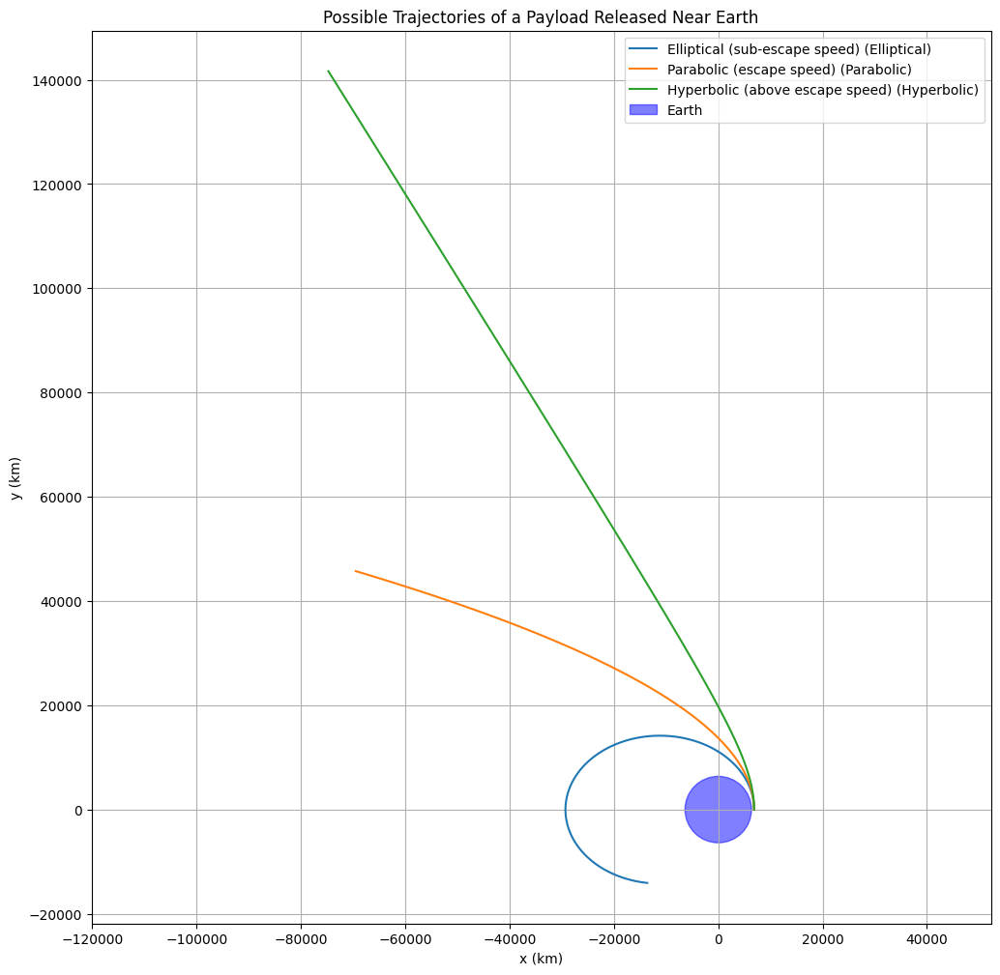
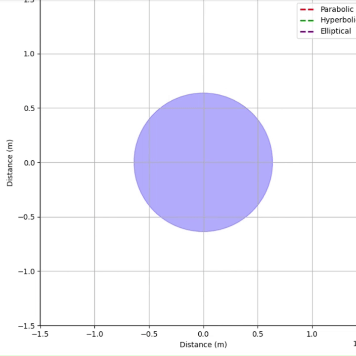
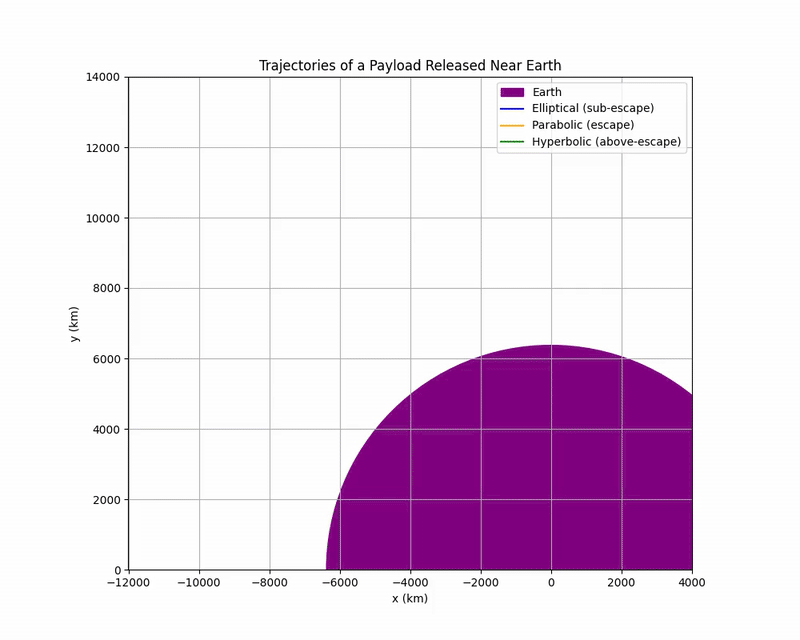
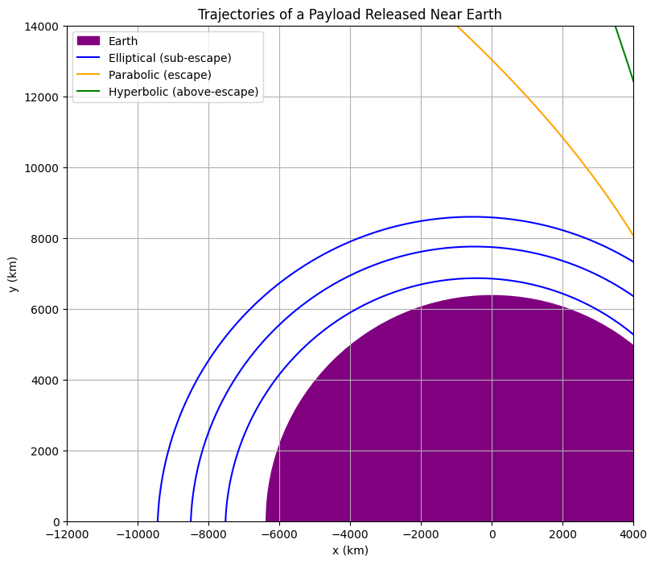
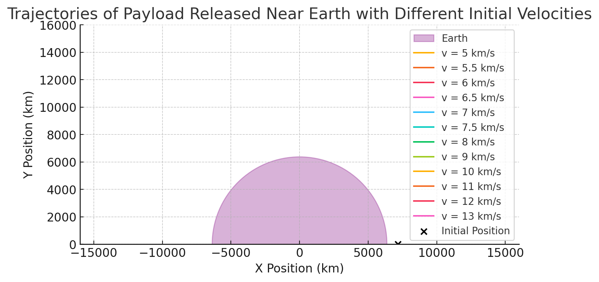
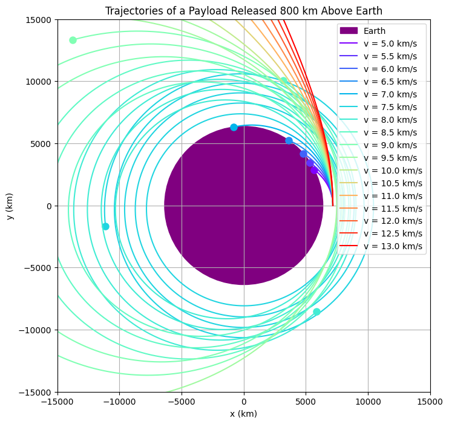
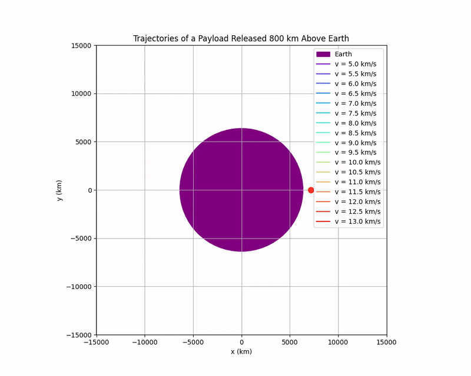

# Problem 3

# Trajectories of a Freely Released Payload Near Earth

## Task 1 - Analyze the Possible Trajectories

When a payload is freely released near Earth, its trajectory depends on its initial velocity relative to Earth. The possible types of trajectories include:

- **Elliptical Orbit** (Bound orbit, $e < 1$)
- **Parabolic Trajectory** (Escape trajectory, $e = 1$)
- **Hyperbolic Trajectory** (Unbound trajectory, $e > 1$)

Where $e$ is the eccentricity of the trajectory.

### Fundamental Principles

1. **Newton's Law of Universal Gravitation:**

$$
F = G \frac{m_1 m_2}{r^2}
$$

Where:
- $F$ is the gravitational force,
- $G$ is the gravitational constant ($6.67430 \times 10^{-11} \, \mathrm{m^3 \, kg^{-1} \, s^{-2}}$),
- $m_1$ and $m_2$ are the masses,
- $r$ is the distance between their centers.

2. **Newton's Second Law:**

$$
F = m a
$$

Combining with gravitational force:

$$
a = G \frac{M}{r^2}
$$

where $M$ is the mass of the Earth.

3. **Conservation of Energy:**

Total specific mechanical energy $\epsilon$ (energy per unit mass) is:

$$
\epsilon = \frac{v^2}{2} - \frac{G M}{r}
$$

- If $\epsilon < 0$: **Elliptical Orbit**
- If $\epsilon = 0$: **Parabolic Escape**
- If $\epsilon > 0$: **Hyperbolic Escape**

4. **Kepler’s Laws:**
- First Law: Orbit of a planet (or satellite) is an ellipse with the Earth at one focus.
- Second Law: Line joining satellite and Earth sweeps equal areas in equal times.
- Third Law: The square of the period is proportional to the cube of the semi-major axis.

$$
T^2 \propto a^3
$$

---

## Example Scenarios

| Initial Velocity | Trajectory Type | Application Example |
| :--------------- | :-------------- | :------------------ |
| Less than circular orbital velocity | Elliptical orbit | Low Earth Orbit satellites |
| Equal to circular orbital velocity | Circular orbit (special ellipse) | GPS satellites |
| Greater than circular but less than escape velocity | Elliptical orbit | Transfer orbits |
| Escape velocity exactly | Parabolic trajectory | Escape to interplanetary space |
| Greater than escape velocity | Hyperbolic trajectory | Interstellar probes (Voyager 1/2) |

### Important Values (Near Earth's Surface)

- Circular orbital speed:

$$
v_c = \sqrt{ \frac{G M}{r} } \approx 7.8 \, \text{km/s}
$$

- Escape speed:

$$
v_{esc} = \sqrt{2} v_c \approx 11.2 \, \text{km/s}
$$

---

## Simulation and Visualization

We'll simulate a payload trajectory under Earth's gravity using numerical integration (Euler method for simplicity).

Below is Python code for **Google Colab**:

```python
import numpy as np
import matplotlib.pyplot as plt

# Constants
G = 6.67430e-11           # gravitational constant (m^3 kg^-1 s^-2)
M_earth = 5.972e24        # mass of Earth (kg)
R_earth = 6371e3          # radius of Earth (m)
mu = G * M_earth          # standard gravitational parameter

# Functions to calculate orbit type based on energy
def orbit_type(v0, r0):
    specific_energy = 0.5 * v0**2 - mu / r0
    if np.isclose(specific_energy, 0, atol=1e5):  # Near zero energy
        return "Parabolic"
    elif specific_energy > 0:
        return "Hyperbolic"
    else:
        return "Elliptical"

# Simulation function
def simulate_orbit(r0, v0_vec, dt=1, t_max=20000):
    steps = int(t_max / dt)
    r = r0.copy()
    v = v0_vec.copy()
    trajectory = np.zeros((steps, 2), dtype=float)
    trajectory[0] = r

    for i in range(1, steps):
        r_norm = np.linalg.norm(r)
        a = -mu / r_norm**3 * r
        v += a * dt
        r += v * dt
        trajectory[i] = r

        if r_norm < R_earth:
            print(f"🌍 Crashed into Earth at t={i*dt} s")
            return trajectory[:i]
        
        if r_norm > 30*R_earth:  # Far away = escaped
            print(f"🚀 Escaped Earth's gravity at t={i*dt} s")
            return trajectory[:i]

    return trajectory

# Initial Conditions
altitude = 500e3  # 500 km above Earth
r0 = np.array([R_earth + altitude, 0.0], dtype=float)

# Theoretical escape velocity
v_escape = np.sqrt(2 * mu / np.linalg.norm(r0))
print(f"Theoretical escape velocity: {v_escape/1000:.2f} km/s")

# Different cases to try
cases = {
    'Elliptical (sub-escape speed)': 0.9 * v_escape,
    'Parabolic (escape speed)': 1.0 * v_escape,
    'Hyperbolic (above escape speed)': 1.2 * v_escape
}

# Plot all cases
plt.figure(figsize=(12, 12))

for label, v0 in cases.items():
    v0_vec = np.array([0.0, v0], dtype=float)  # pure y-velocity
    orbit_kind = orbit_type(np.linalg.norm(v0_vec), np.linalg.norm(r0))
    print(f"\n🔵 {label}: {orbit_kind} orbit")
    traj = simulate_orbit(r0.copy(), v0_vec.copy())

    plt.plot(traj[:,0]/1e3, traj[:,1]/1e3, label=f'{label} ({orbit_kind})')

# Earth
earth = plt.Circle((0, 0), R_earth/1e3, color='blue', alpha=0.5, label='Earth')
plt.gca().add_artist(earth)

plt.xlabel('x (km)')
plt.ylabel('y (km)')
plt.title('Possible Trajectories of a Payload Released Near Earth')
plt.legend()
plt.grid(True)
plt.axis('equal')
plt.show()
```



## 1. What Does the Graph Represent?
The graph shows three possible trajectories of a payload released near Earth, plotted in a 2D plane with coordinates \( x \) and \( y \) (in kilometers). The trajectories depend on the payload’s initial velocity relative to Earth’s escape speed:

- **Blue Line**: Elliptical trajectory (sub-escape speed, elliptic).
- **Orange Line**: Parabolic trajectory (at escape speed, parabolic).
- **Green Line**: Hyperbolic trajectory (above escape speed, hyperbolic).
- **Purple Circle**: Represents Earth, centered at the origin with a radius of approximately 6,371 km (Earth’s radius).

The graph demonstrates how the payload’s path changes based on its velocity when released from a point near Earth.

---

## 2. Understanding the Axes and Setup

- **X-axis** ($x$, km): Horizontal position of the payload, ranging from approximately $-12,000$ km to $+4,000$ km.
- **Y-axis** ($y$, km): Vertical position of the payload, ranging from $0$ km to $14,000$ km.
- **Earth**: The purple circle at the origin represents Earth, with a radius of approximately $6,371$ km.
- **Release Point**: The payload is released from a point near Earth’s surface, likely around:
  $$
  (x, y) = (6,371 \, \text{km}, 0)
  $$

---

## 3. Escape Speed and Trajectories

The trajectories depend on the payload’s velocity compared to Earth’s escape speed.

The escape speed $v_{\text{esc}}$ is the minimum speed required for an object to escape Earth’s gravitational pull without further propulsion:

$$
v_{\text{esc}} = \sqrt{\frac{2GM}{r}}
$$

Where:
- $G$: Gravitational constant ($6.674 \times 10^{-11} \, \text{m}^3 \, \text{kg}^{-1} \, \text{s}^{-2}$),
- $M$: Mass of Earth ($5.972 \times 10^{24} \, \text{kg}$),
- $r$: Distance from Earth's center (at the surface, $r \approx 6,371$ km).

Calculating escape speed at Earth's surface:

$$
GM \approx 3.986 \times 10^{14} \, \text{m}^3/\text{s}^2
$$
$$
r = 6,371 \, \text{km} = 6.371 \times 10^6 \, \text{m}
$$
$$
v_{\text{esc}} = \sqrt{\frac{2 \times 3.986 \times 10^{14}}{6.371 \times 10^6}} \approx 11,186 \, \text{m/s} \approx 11.2 \, \text{km/s}
$$

### Depending on speed:
- **Sub-escape speed** ($v < v_{\text{esc}}$): Elliptical orbit (bound to Earth).
- **At escape speed** ($v = v_{\text{esc}}$): Parabolic trajectory (just escapes).
- **Above escape speed** ($v > v_{\text{esc}}$): Hyperbolic trajectory (escapes with excess energy).

---

## 4. Analyzing the Trajectories

### Blue Line: Elliptical Trajectory (Sub-escape Speed)

- **Description**: The payload’s speed is less than the escape speed ($v < 11.2 \, \text{km/s}$).
- **Path**: The payload follows an **elliptical orbit** around Earth.
- **Physics**: 
  - Total mechanical energy is **negative**:
    $$
    E = \frac{1}{2}mv^2 - \frac{GMm}{r}
    $$
  - The payload remains bound to Earth.

---

### Orange Line: Parabolic Trajectory (At Escape Speed)

- **Description**: The payload’s speed equals the escape speed ($v = 11.2 \, \text{km/s}$).
- **Path**: The payload follows a **parabolic trajectory**.
- **Physics**: 
  - Total mechanical energy is **zero**:
    $$
    E = \frac{1}{2}mv_{\text{esc}}^2 - \frac{GMm}{r} = 0
    $$
  - The payload just barely escapes Earth's gravity, slowing down to zero at infinity.

---

### Green Line: Hyperbolic Trajectory (Above Escape Speed)

- **Description**: The payload’s speed is greater than the escape speed ($v > 11.2 \, \text{km/s}$).
- **Path**: The payload follows a **hyperbolic trajectory**.
- **Physics**: 
  - Total mechanical energy is **positive**:
    $$
    E = \frac{1}{2}mv^2 - \frac{GMm}{r} > 0
    $$
  - The payload escapes Earth's gravitational influence and continues outward indefinitely.

---

## 5. Interpreting the Graph

- **Elliptical (Blue)**: The payload loops around Earth, showing a stable orbit (like a satellite).
- **Parabolic (Orange)**: The payload escapes Earth with just enough energy, slowing to zero velocity at infinity.
- **Hyperbolic (Green)**: The payload escapes Earth with excess speed, moving away forever.

The **release point** is near Earth's surface ($x \approx 6,371$ km, $y = 0$), and the **initial velocity** is tangential or slightly outward.

---

## 6. Applications

This graph is useful for understanding:

- **Spacecraft Trajectories**: Deciding if a spacecraft orbits Earth or escapes it.
- **Escape Velocity**: Critical for missions to other planets or deep space.
- **Orbital Mechanics**: Understanding how satellites (elliptical orbits) and probes (hyperbolic paths) behave.

---

# Summary
The graph illustrates the possible trajectories based on the payload’s speed:

| Type        | Condition                | Path      |
|:------------|:--------------------------|:----------|
| Elliptical  | $v < v_{\text{esc}}$       | Bound orbit |
| Parabolic   | $v = v_{\text{esc}}$       | Just escapes |
| Hyperbolic  | $v > v_{\text{esc}}$       | Escapes with excess speed |

These trajectories highlight the fundamental principles of orbital mechanics governed by gravity and initial velocity.

## Animation



---

## Real-World Applications

- **Space Mission Planning:** Calculate trajectories to reach orbit, Moon, or Mars.
- **Satellite Deployment:** Place satellites into stable orbits or move between orbits (e.g., Hohmann transfers).
- **Planetary Exploration:** Sending spacecraft on hyperbolic escape trajectories (e.g., Voyager missions).
- **Defense Systems:** Understanding missile paths (ballistic trajectories).

---

## Task 2: Numerical Analysis of Payload Path Based on Initial Conditions

---

## Introduction

We aim to **numerically compute** the path of a payload **freely released** near Earth using:

- **Newton's Law of Gravitation**
- **Kepler's Laws of Orbital Motion**
- **Numerical integration methods** (Euler or Runge-Kutta)

This simulation provides insight into **real-world applications** such as:
- Space mission planning 🚀
- Satellite deployment 🛰️
- Planetary exploration 🌌

---

## Fundamental Physical Principles

### Newton's Law of Universal Gravitation

The gravitational force $F$ between Earth and the payload:

$$
F = \frac{GMm}{r^2}
$$

Where:
- $G = 6.674 \times 10^{-11} \, \text{N m}^2 \text{kg}^{-2}$ (Gravitational constant)
- $M = 5.972 \times 10^{24} \, \text{kg}$ (Mass of Earth)
- $m$ = Mass of the payload (cancels out later)
- $r$ = Distance between payload and Earth’s center

The **acceleration** $\vec{a}$ due to gravity:

$$
\vec{a} = -\frac{GM}{r^3} \vec{r}
$$

Where $\vec{r}$ is the position vector from Earth's center.

---

### Kepler’s Laws (Simplified)

- **First Law**: Payloads move in elliptical orbits with Earth at one focus.
- **Second Law**: Equal areas are swept in equal times.
- **Third Law**: The square of the orbital period is proportional to the cube of the semi-major axis.

---

## Numerical Simulation Setup

We solve the **second-order differential equations**:

$$
\frac{d^2 \vec{r}}{dt^2} = -\frac{GM}{r^3} \vec{r}
$$

By rewriting them as two coupled **first-order** ODEs:

$$
\frac{d\vec{r}}{dt} = \vec{v}
$$
$$
\frac{d\vec{v}}{dt} = -\frac{GM}{r^3} \vec{r}
$$

Where:
- $\vec{r} = (x, y)$ is the position,
- $\vec{v} = (v_x, v_y)$ is the velocity.

---

### Initial Conditions

We define:
- **Initial altitude**: $h$
- **Initial position**: 

$$
\vec{r_0} = (R_{\text{Earth}} + h, 0)
$$

- **Initial velocity** (in $y$ direction):

$$
\vec{v_0} = (0, v_{y0})
$$

Where $R_{\text{Earth}} \approx 6,371$ km.

Depending on $v_{y0}$:
- $v_{y0} < v_{\text{esc}}$ → Elliptical
- $v_{y0} = v_{\text{esc}}$ → Parabolic
- $v_{y0} > v_{\text{esc}}$ → Hyperbolic

Escape velocity:

$$
v_{\text{esc}} = \sqrt{\frac{2GM}{R_{\text{Earth}} + h}}
$$

---





## 1. What Does the Graph Represent?

The graph shows three possible trajectories of a payload released near Earth, plotted in a 2D plane with coordinates \(x\) and \(y\) (in kilometers). The trajectories depend on the payload’s initial velocity relative to Earth’s escape speed:

- **Blue Lines**: Elliptical trajectories (sub-escape speed, elliptic).
- **Orange Line**: Parabolic trajectory (at escape speed, parabolic).
- **Green Line**: Hyperbolic trajectory (above escape speed, hyperbolic).
- **Purple Region**: Represents Earth, centered at the origin with a radius of approximately 6,371 km (Earth’s radius).

The graph demonstrates how the payload’s path changes based on its velocity when released from a point near Earth. Unlike a simple graph, this one shows **multiple elliptical orbits**, indicating different sub-escape speeds.

---

## 2. Understanding the Axes and Setup

- **X-axis** (\(x\), km): Horizontal position of the payload, ranging from -12,000 km to 4,000 km.
- **Y-axis** (\(y\), km): Vertical position of the payload, ranging from 0 km to 14,000 km.
- **Earth**: The purple region at the origin represents Earth, with a radius of approximately 6,371 km.
- **Release Point**: The payload is released near Earth's surface, likely at the rightmost edge (\(x=6,371\, \text{km}\), \(y=0\)).

---

## 3. Escape Speed and Trajectories

The trajectories depend on the payload’s velocity compared to Earth’s escape speed. The escape speed \(v_{\text{esc}}\) is the minimum speed required to escape Earth's gravitational pull without further propulsion.

Escape speed formula:

$$
v_{\text{esc}} = \sqrt{\frac{2GM}{r}}
$$

Thus:

$$
GM \approx 3.986 \times 10^{14}\, \text{m}^3\text{s}^{-2}
$$

Then:

$$
v_{\text{esc}} = \sqrt{\frac{2 \times 3.986 \times 10^{14}}{6.371 \times 10^6}} \approx 11,186\, \text{m/s} \approx 11.2\, \text{km/s}
$$

The trajectory depends on the speed relative to this escape speed:

- **Sub-escape speed** (\(v < v_{\text{esc}}\)): Elliptical orbit.
- **At escape speed** (\(v = v_{\text{esc}}\)): Parabolic trajectory.
- **Above escape speed** (\(v > v_{\text{esc}}\)): Hyperbolic trajectory.

---

## 4. Analyzing the Trajectories

### Blue Lines: Elliptical Trajectories (Sub-escape Speed)

- **Description**: Payload’s speed is less than escape speed (\(v < 11.2\, \text{km/s}\)).
- **Path**: The payload follows elliptical orbits around Earth. Each blue line represents a closed loop.
- **Physics**: The total mechanical energy is negative:

$$
E = \frac{1}{2}mv^2 - \frac{GMm}{r}
$$

---

### Orange Line: Parabolic Trajectory (At Escape Speed)

- **Path**: The payload follows a parabolic trajectory, moving asymptotically away from Earth.
- **Physics**: The total mechanical energy is zero:

$$
E = \frac{1}{2}mv_{\text{esc}}^2 - \frac{GMm}{r} = 0
$$

The payload slows down as it escapes, reaching zero velocity at infinity.

---

### Green Line: Hyperbolic Trajectory (Above Escape Speed)

- **Path**: The payload follows a hyperbolic trajectory, escaping Earth’s gravity with excess velocity.
- **Physics**: The total mechanical energy is positive:

$$
E = \frac{1}{2}mv^2 - \frac{GMm}{r} > 0
$$

The payload continues to move indefinitely with a nonzero velocity.

---

## 5. Interpreting the Graph

- **Elliptical (Blue)**: Multiple closed loops around Earth, representing bound stable orbits.
- **Parabolic (Orange)**: The payload just escapes Earth's gravity, slowing toward zero velocity at infinity.
- **Hyperbolic (Green)**: The payload escapes Earth's gravity completely with residual velocity.

The release point is tangential to Earth's surface, causing these orbital paths.

---

## 6. Applications

This graph is fundamental for:

- **Spacecraft Trajectories**: Deciding if the spacecraft will orbit or escape Earth.
- **Escape Velocity**: Critical for planning interplanetary missions.
- **Orbital Mechanics**: Understanding satellite orbits (elliptical) vs interstellar missions (hyperbolic).

---

# Summary

The graph illustrates the possible trajectories of a payload released near Earth based on its velocity relative to the escape speed $\approx 11.2$.

- **Elliptical (sub-escape speed)**: Bound orbits around Earth (blue).
- **Parabolic (at escape speed)**: Just escapes Earth, slowing to zero at infinity (orange).
- **Hyperbolic (above escape speed)**: Escapes Earth with excess speed (green).

These trajectories highlight the essential principles of orbital mechanics, governed by gravitational forces and the initial energy of the payload.



## Task 3. Trajectories and Their Relation to Orbital Insertion, Reentry, and Escape Scenarios

## Orbital Insertion

**Orbital insertion** refers to the process of placing a payload (such as a satellite) into a stable orbit around Earth. This process involves controlling the velocity and trajectory of the payload so that it enters a **circular or elliptical orbit**.

- **Elliptical Trajectories (Blue Lines)**: 

    When a payload is launched with a velocity less than the escape speed, it follows an **elliptical trajectory**. This type of trajectory is common in **orbital insertion** scenarios, as it allows the payload to remain in a closed orbit around Earth. The size of the ellipse depends on the payload’s initial velocity. A higher velocity results in a larger elliptical orbit, while a lower velocity results in a smaller one.

    For example, satellites placed in **low Earth orbit (LEO)** or **geostationary orbit (GEO)** typically follow elliptical orbits as part of their insertion.

    - The total mechanical energy of the payload is negative, indicating that it is bound to Earth:

    $$
    E = \frac{1}{2}mv^2 - \frac{GMm}{r}
    $$

## Reentry

**Reentry** occurs when a spacecraft, such as a returning satellite or crewed space capsule, re-enters Earth’s atmosphere after completing a mission. This process requires precise control of the spacecraft’s trajectory and velocity to ensure it returns safely to Earth.

- **Elliptical Trajectories (Blue Lines)**: 

    In many reentry scenarios, spacecraft follow an elliptical or sub-escape trajectory. As a spacecraft approaches Earth, it enters the atmosphere on an elliptical path. The perigee (the closest point to Earth) of this ellipse is typically very close to Earth’s surface.

    - As the spacecraft’s velocity decreases due to atmospheric drag, it may eventually fall into a **sub-orbital trajectory**, where it will reenter the atmosphere and land.

- **Hyperbolic Trajectories (Green Lines)**: 

    If a spacecraft escapes Earth’s gravity and then returns on a **hyperbolic trajectory**, it will follow a very fast, unbounded path back toward Earth. To prevent catastrophic damage, the spacecraft needs to slow down and reenter at a controlled angle to avoid burning up due to the high-speed descent.

    The total mechanical energy of a spacecraft on a hyperbolic trajectory is positive, indicating that the spacecraft has enough energy to escape Earth’s gravity:

    $$
    E = \frac{1}{2}mv^2 - \frac{GMm}{r} > 0
    $$

    If the spacecraft is returning to Earth from interplanetary space, it will need to reenter the atmosphere at a controlled speed to avoid excessive heat buildup from reentry friction.

## Escape Scenarios

**Escape** occurs when a payload (or spacecraft) is launched with enough velocity to overcome Earth’s gravitational pull and continue traveling into space indefinitely. The payload follows a trajectory that is either **parabolic** or **hyperbolic**.

- **Parabolic Trajectory (Orange Line)**:

    When a payload is launched with exactly the escape speed, it follows a **parabolic trajectory**. This trajectory represents the minimum speed required for the payload to escape Earth’s gravity. After reaching a maximum distance, the payload will slow down and eventually come to a stop at infinity.

    - The total mechanical energy of the payload is zero, indicating that the energy is just enough to escape Earth’s gravity:

    $$
    E = \frac{1}{2}mv_{\text{esc}}^2 - \frac{GMm}{r} = 0
    $$

    This type of trajectory is used in **space missions** that require the payload to escape Earth's gravitational influence, such as missions to the Moon, Mars, or interstellar space.

- **Hyperbolic Trajectory (Green Line)**:

    If the payload’s velocity is greater than the escape speed, it follows a **hyperbolic trajectory**. This is common for spacecraft that leave Earth with excess speed. For example, interplanetary probes or spacecraft leaving the solar system (like Voyager) follow hyperbolic trajectories.

    - The total mechanical energy of the payload is positive, indicating excess energy:

    $$
    E = \frac{1}{2}mv^2 - \frac{GMm}{r} > 0
    $$

    The spacecraft will continue to move away from Earth, traveling indefinitely in space. This trajectory is used for **escape missions** with high velocities, such as deep space exploration.

## Summary of Applications in Space Missions

- **Orbital Insertion**: The payload follows an elliptical orbit (blue lines), which allows it to remain in orbit around Earth.
- **Reentry**: If the payload is on an elliptical or hyperbolic trajectory (blue or green lines), it may reenter Earth's atmosphere. The reentry speed must be carefully controlled to prevent burning up.
- **Escape**: The payload follows a parabolic or hyperbolic trajectory (orange or green lines) to escape Earth’s gravitational influence and travel into space.

Each of these scenarios involves controlling the payload’s velocity and trajectory to ensure successful mission outcomes, whether staying in orbit, returning to Earth, or escaping to other celestial bodies.

## OSIRIS-REx Trajectory July 2022 - October 2023


NASA’s OSIRIS-REx is the first U.S. mission to collect a sample from an asteroid. The OSIRIS-REx spacecraft will deliver a capsule with fragments of asteroid Bennu to Earth on Sept. 24, 2023. The spacecraft briefly touched down on Bennu in October 2020 and gathered an estimated cupful of material. Seven months later, it departed Bennu on a 1.2-billion-mile cruise back to Earth. OSIRIS-REx will release the capsule above Earth’s atmosphere for a landing in Utah’s West Desert and continue flying past Earth. After delivering the sample, the spacecraft will adopt a new name for an extended mission to asteroid Apophis: OSIRIS-APEX. It will spend 5.5 years in an elliptical orbit of the Sun and rendezvous with Apophis in 2029. It will orbit and study Apophis for 1.5 years and then venture close to its surface to stir up loose material. 

This visualization depicts a portion (July 2022 – October 2023) of the spacecraft’s return cruise from Bennu to Earth. 



