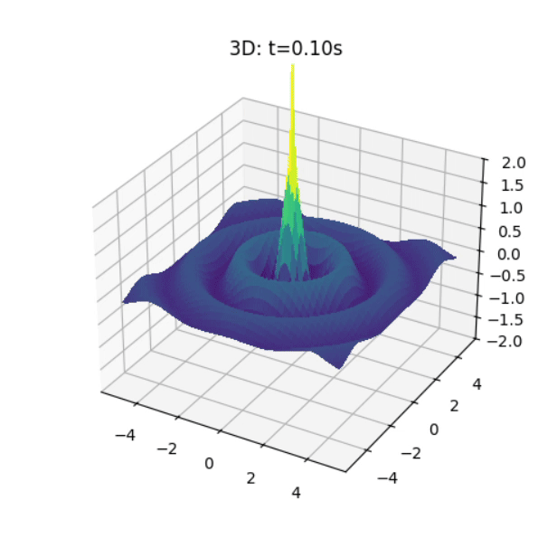

# Problem 1

# Interference Patterns on a water surface

## Water‐Surface Wave Interference from a Regular Polygon of Sources

We model the single disturbance from a point source at \((x_i,y_i)\) by

$$
\eta_i(x,y,t)
=
\frac{A}{\sqrt{r_i}} \,\cos\!\bigl(k\,r_i - \omega\,t + \phi\bigr),
\quad
r_i = \sqrt{(x - x_i)^2 + (y - y_i)^2}
$$

and then superpose \(N\) such waves:

$$
\eta_{\rm sum}(x,y,t) \;=\;\sum_{i=1}^N \eta_i(x,y,t).
$$

## 1

## 2
