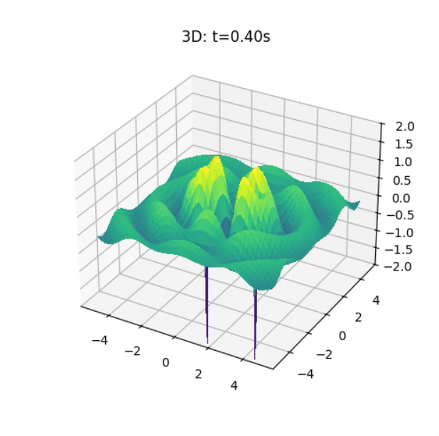
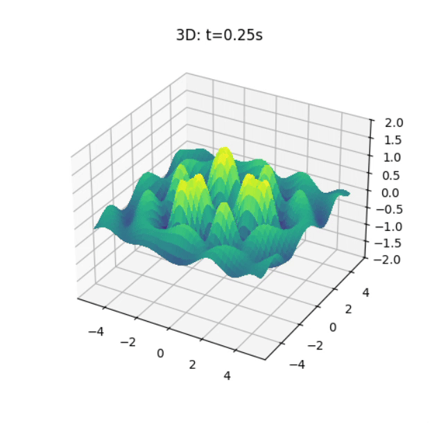

# Problem 1

# Interference Patterns on a water surface

## Water‐Surface Wave Interference from a Regular Polygon of Sources

We model the single disturbance from a point source at \((x_i,y_i)\) by

$$
\eta_i(x,y,t)
=
\frac{A}{\sqrt{r_i}} \,\cos\!\bigl(k\,r_i - \omega\,t + \phi\bigr),
\quad
r_i = \sqrt{(x - x_i)^2 + (y - y_i)^2}
$$

and then superpose \(N\) such waves:

$$
\eta_{\rm sum}(x,y,t) \;=\;\sum_{i=1}^N \eta_i(x,y,t).
$$

## 1

## 2

## 3

## 4

# 1. What Is a Wave?  
A **wave** is a disturbance that transfers energy (and often momentum) through a medium or through space, without the bulk motion of the medium’s particles. Examples:

- Ripples on a pond  
- Sound in air  
- Light in a vacuum  

---

# 2. Key Terms & Parameters

| Symbol | Name              | Definition                                                     |
|:------:|:-----------------:|:---------------------------------------------------------------|
| \(A\)  | Amplitude         | Maximum displacement from equilibrium                          |
| \(\lambda\) | Wavelength   | Distance over which the wave’s shape repeats                   |
| \(T\)  | Period            | Time for one complete cycle (seconds)                          |
| \(f\)  | Frequency         | Number of cycles per second; \(\displaystyle f = \tfrac{1}{T}\) (Hz) |
| \(v\)  | Wave speed        | \(\displaystyle v = \lambda\,f\) (m/s)                          |
| \(k\)  | Wavenumber        | \(\displaystyle k = \tfrac{2\pi}{\lambda}\) (rad/m)             |
| \(\omega\) | Angular frequency | \(\displaystyle \omega = 2\pi\,f\) (rad/s)                  |

---

# 3. Types of Waves

1. **Mechanical vs. Electromagnetic**  
   - *Mechanical*: Require a medium (e.g. water waves, sound)  
   - *Electromagnetic*: Can travel in vacuum (e.g. light, radio)  

2. **Transverse vs. Longitudinal**  
   - *Transverse*: Oscillation ⟂ direction of propagation (e.g. water surface, EM waves)  
   - *Longitudinal*: Oscillation ∥ direction of propagation (e.g. sound in air)  

3. **Progressive vs. Standing**  
   - *Progressive (Traveling) Waves*: Energy and phase travel through space  
   - *Standing Waves*: Fixed nodes and antinodes—result of two opposite traveling waves of equal frequency and amplitude  

---

# 4. Basic Wave Equations

## 4.1 Plane Harmonic Wave  
A one‐dimensional traveling wave along \(x\):
$$
y(x,t) \;=\; A \,\cos\!\bigl(k\,x \;-\;\omega\,t \;+\;\phi\bigr)
$$

## 4.2 Wave Equation (1D)  
The standard 1D wave equation is
$$
\frac{\partial^2 y}{\partial x^2}
\;=\;
\frac{1}{v^2}
\,
\frac{\partial^2 y}{\partial t^2}.
$$

---

# 5. Dispersion & Group Velocity

- **Dispersion**: When wave speed \(v\) depends on wavelength \(\lambda\). Different frequency components travel at different speeds.  
- **Group velocity**:
$$
v_g \;=\; \frac{d\omega}{dk},
$$  
the speed at which a wave packet (and thus energy/information) propagates.

---

# 6. Examples in Nature

- **Ocean waves**: Gravity-driven surface waves, dispersion relation
  $$
    \omega^2 = g\,k\,\tanh(k\,h).
  $$
- **Sound waves**: Pressure oscillations governed by the acoustic wave equation.  
- **Light waves**: Oscillating electric and magnetic fields governed by Maxwell’s equations.
