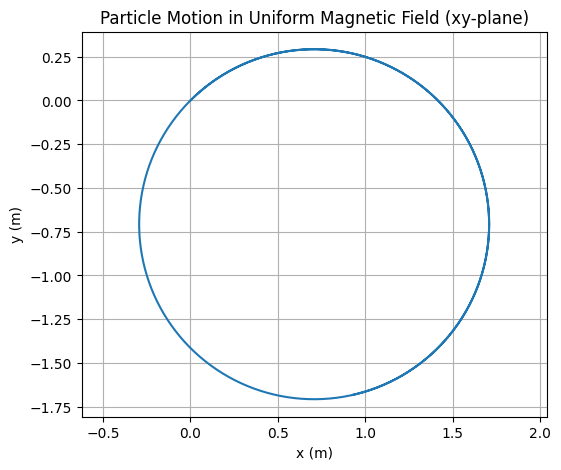
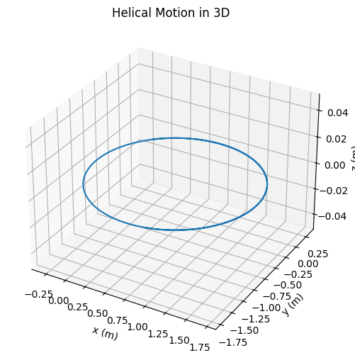
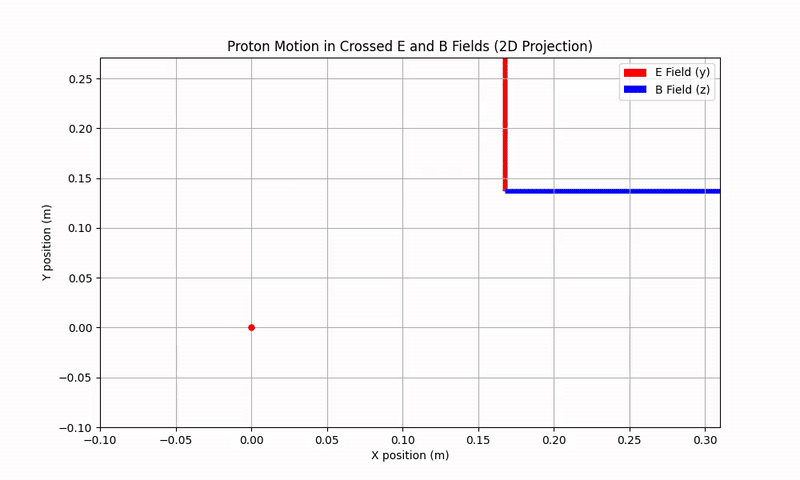
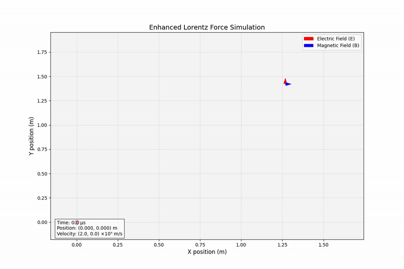

# Problem 1

# Simulating the effects of the Lorentz Force

## Mathematical Definition

The Lorentz force describes the combined effect of electric and magnetic fields on a charged particle:

$$
\vec{F} = q(\vec{E} + \vec{v} \times \vec{B})
$$

Where:
- $\vec{F}$ is the force (N)
- $q$ is the particle charge (C)
- $\vec{v}$ is the particle velocity (m/s)
- $\vec{E}$ is the electric field (V/m)
- $\vec{B}$ is the magnetic field (T)

## Key Components

### 1. Electric Field Contribution
$$
\vec{F}_E = q\vec{E}
$$

- Always parallel to $\vec{E}$ field
- Accelerates charges along field lines

### 2. Magnetic Field Contribution
$$
\vec{F}_B = q(\vec{v} \times \vec{B})
$$

- Perpendicular to both $\vec{v}$ and $\vec{B}$
- Does no work ($\vec{F}_B \cdot \vec{v} = 0$)

## Special Cases

### Crossed Fields ($\vec{E} \perp \vec{B}$)
Produces characteristic drift motion:

$$
\vec{v}_d = \frac{\vec{E} \times \vec{B}}{B^2}
$$

### Pure Magnetic Field
Leads to circular motion with cyclotron frequency:

$$
\omega_c = \frac{qB}{m}
$$

Radius of gyration:
$$
r_c = \frac{mv_\perp}{qB}
$$

## Applications

### 1. Particle Accelerators
- Magnetic fields bend particle trajectories
- Electric fields provide acceleration
- Relativistic correction:
  $$
  \vec{F} = \frac{q}{c}(\vec{v} \times \vec{B}) \quad \text{(for } v \approx c\text{)}
  $$

### 2. Mass Spectrometers
- Separation by mass-to-charge ratio ($m/q$)
- Workspace equation:
  $$
  \frac{m}{q} = \frac{B^2r^2}{2V}
  $$

### 3. Plasma Confinement
- Tokamaks use toroidal magnetic fields
- Magnetic mirror effect:
  $$
  \mu = \frac{mv_\perp^2}{2B} \quad \text{(magnetic moment)}
  $$

### 4. Hall Effect Devices
- Measure carrier density:
  $$
  n = \frac{IB}{qV_H t}
  $$

## Numerical Simulation

The Python simulation demonstrates:

1. **Initial Conditions**:
   $$
   \vec{v}_0 = v_0\hat{x}, \quad \vec{E} = E_0\hat{y}, \quad \vec{B} = B_0\hat{z}
   $$

2. **Equations of Motion**:
   $$
   \frac{d\vec{v}}{dt} = \frac{q}{m}(\vec{E} + \vec{v} \times \vec{B})
   $$
   $$
   \frac{d\vec{r}}{dt} = \vec{v}
   $$

3. **Numerical Integration**:
   Using Runge-Kutta 4th order method for accuracy:
   $$
   k_1 = f(t_n, y_n)
   $$
   $$
   k_2 = f(t_n + \frac{h}{2}, y_n + \frac{h}{2}k_1)
   $$
   $$
   k_3 = f(t_n + \frac{h}{2}, y_n + \frac{h}{2}k_2)
   $$
   $$
   k_4 = f(t_n + h, y_n + hk_3)
   $$
   $$
   y_{n+1} = y_n + \frac{h}{6}(k_1 + 2k_2 + 2k_3 + k_4)
   $$

## Visualization Features

The enhanced simulation shows:
- Cycloid trajectory from crossed fields
- Real-time particle information:
  $$
  \vec{r}(t) = (x(t), y(t))
  $$
  $$
  \vec{v}(t) = (v_x(t), v_y(t))
  $$
- Field vectors and drift velocity:
  $$
  \vec{v}_d = \frac{E_0}{B_0}\hat{x}
  $$

## Animation

 

 