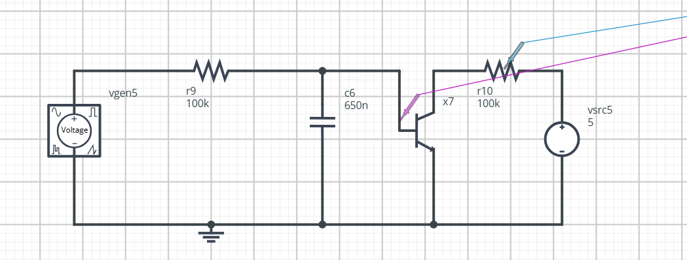
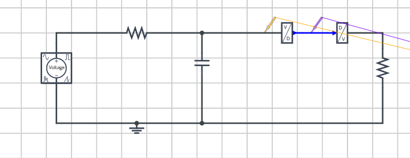
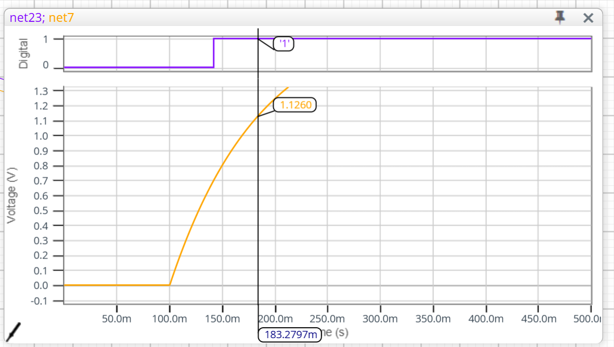
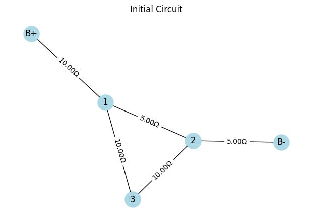
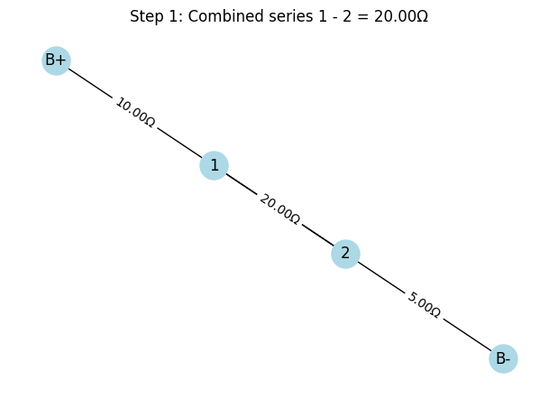
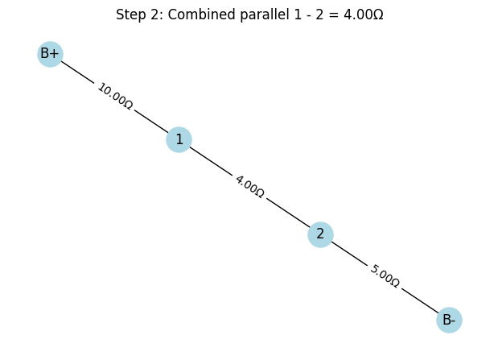
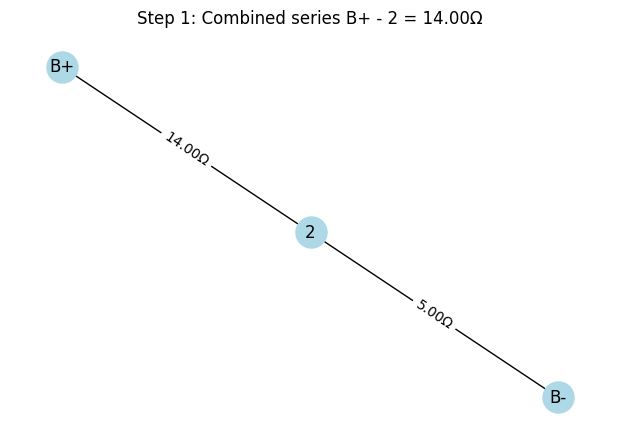
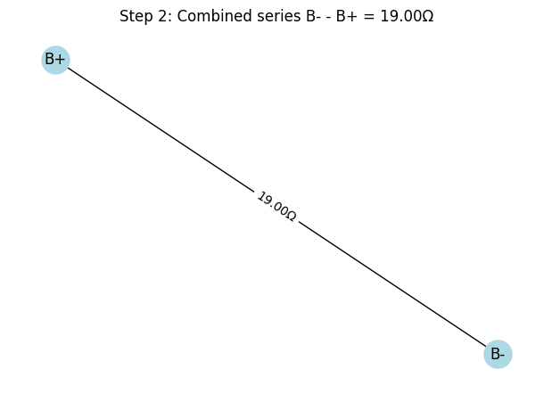
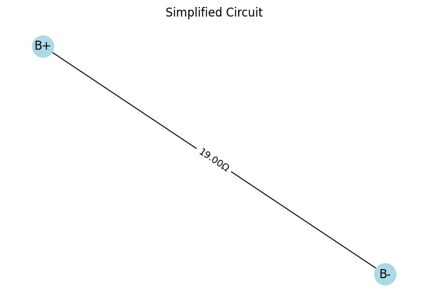

# Problem 1

# Equivalent Resistance Using Graph Theory

## Graph Representation

- **Nodes**: Electrical junctions (including terminals A and B).
- **Edges**: Resistors with resistance values \( R \).
- The network is represented as an **undirected weighted graph**:
  - Nodes = junctions.
  - Edges = resistors labeled with resistance \( R \).

If multiple resistors connect the same pair of nodes, treat them as **parallel** resistors immediately.

---

## Identifying Series and Parallel

### Series:
Two resistors are in **series** if:
- They share a **common node** \( v \) of **degree 2**, and
- \( v \) is **not** a terminal node (not A or B).

Then:
- Edges \( (u - v) \) and \( (v - w) \) are replaced by a single edge \( (u - w) \).
- The equivalent resistance is:

$$
R_{\text{series}} = R_{uv} + R_{vw}
$$

---

### Parallel:
Two or more resistors between the **same pair of nodes** \( (u, w) \) are in **parallel**. They are replaced with a single resistor using:

$$
\frac{1}{R_{\text{parallel}}} = \sum_{i=1}^{k} \frac{1}{R_i}
$$

or equivalently,

$$
R_{\text{parallel}} = \left( \sum_{i=1}^{k} \frac{1}{R_i} \right)^{-1}
$$

# Option 2: Advanced Task – Full Implementation

## Objective

Implement an algorithm to compute the **equivalent resistance** between two nodes in an arbitrary resistor network using **graph theory**.

---

## Requirements

The implementation must:

- Accept a circuit graph as input (nodes and resistors as edges).
- Support **arbitrary configurations**, including **nested** series and parallel combinations.
- Output the final **equivalent resistance** between two designated terminals.

---

## Mathematical Background

### Series Combination

If two resistors are in series:

$$
R_{\text{eq}} = R_1 + R_2
$$

---

### Parallel Combination

If two or more resistors are in parallel:

$$
\frac{1}{R_{\text{eq}}} = \sum_{i=1}^{n} \frac{1}{R_i} \quad \Rightarrow \quad R_{\text{eq}} = \left( \sum_{i=1}^{n} \frac{1}{R_i} \right)^{-1}
$$

## Mathematical Formulation

The algorithm works by recursively applying the series and parallel resistance formulas:

### Series Connection:
For resistors $R_1, R_2, \ldots, R_n$ in series:

$$ R_{eq} = \sum_{i=1}^{n} R_i $$

### Parallel Connection: 
For resistors $R_1, R_2, \ldots, R_n$ in parallel:

$$ R_{eq} = \left( \sum_{i=1}^{n} \frac{1}{R_i} \right)^{-1} $$

## Features

### Arbitrary Nesting:
- Handles complex networks like $S(P(S(1,2),3), P(4,5))$
- Each operation node contains exactly two children (binary tree)

### String Parsing:
- Optional string input format: `"S(P(1,2),3)"` for $(1 \parallel 2) + 3$

### Error Handling:
- Validates network structure
- Checks for invalid resistor values

## Example Calculation

For the network $(1 \parallel 2) + (3 \parallel 4) + 5$:

1. **Parallel branches first**:
   $$ 1 \parallel 2 = \frac{1}{\frac{1}{1} + \frac{1}{2}} = 0.6667\ \Omega $$
   $$ 3 \parallel 4 = \frac{1}{\frac{1}{3} + \frac{1}{4}} = 1.7143\ \Omega $$

2. **Series combination**:
   $$ R_{eq} = 0.6667 + 1.7143 + 5 = 7.3810\ \Omega $$

The code outputs this result with 2 decimal places: $7.38\ \Omega$.

## 1

## 2

# LED Blinking Circuit Explanation

This is a basic LED blinking circuit powered by a 9V battery. The components in the circuit are:

- **9V Battery**: Power supply providing constant voltage.
- **220Ω Resistor**: Limits the current to protect the LED.
- **LED (Light Emitting Diode)**: Emits light when current flows through it.
- **Switch**: Controls the flow of current (ON/OFF).

## Circuit Path

When the switch is **closed** (ON), the electrical current flows from the positive terminal of the battery through the resistor, then the LED, and finally returns to the negative terminal of the battery.

### Purpose of the Resistor

The resistor is crucial to prevent excessive current from damaging the LED.

Using Ohm's Law:

$$
V = IR
$$

Where:

- \( V \) = Voltage across the resistor and LED (approximately 9V from battery)
- \( I \) = Current through the circuit
- \( R \) = Resistance (220Ω)

Assuming the LED forward voltage drop is approximately 2V:

$$
V_R = V_{battery} - V_{LED} = 9V - 2V = 7V
$$

Then the current \( I \) is:

$$
I = \frac{V_R}{R} = \frac{7V}{220Ω} \approx 0.0318A = 31.8mA
$$

This is within safe operating limits for most standard LEDs.

## Conclusion

When the switch is turned ON, the LED lights up as current flows through the circuit. The resistor ensures that the current remains safe for the LED.

# Series vs. Parallel Circuit Explanation

This image compares two fundamental types of electrical circuits: **Series** and **Parallel**.

---

## Series Circuit

In a **series circuit**, components are connected end-to-end, forming a single path for current to flow.

### Characteristics:

- Current flows through each component sequentially.
- If **one component fails**, the **entire circuit stops working**.
- The total resistance increases:

$$
R_{total} = R_1 + R_2 + R_3 + \dots + R_n
$$

- The current is the **same** through all components:

$$
I_{total} = I_1 = I_2 = \dots = I_n
$$

- Voltage is **divided** among the components:

$$
V_{total} = V_1 + V_2 + \dots + V_n
$$

**Example in Image:** One bulb is removed or broken, so the other bulb also goes out.

---

## Parallel Circuit

In a **parallel circuit**, components are connected across the same voltage source, forming multiple paths for the current.

### Characteristics:

- Each component gets the **same voltage**:

$$
V_{total} = V_1 = V_2 = \dots = V_n
$$

- The total current is the **sum** of the currents in each branch:

$$
I_{total} = I_1 + I_2 + \dots + I_n
$$

- The total resistance is **less** than the smallest resistor:

$$
\frac{1}{R_{total}} = \frac{1}{R_1} + \frac{1}{R_2} + \dots + \frac{1}{R_n}
$$

**Example in Image:** One bulb is removed or broken, but the other bulb **continues to work**.

---

## 🔍 Summary Table

| Feature              | Series Circuit       | Parallel Circuit      |
|----------------------|----------------------|------------------------|
| Path for current     | One                  | Multiple               |
| Effect of break      | Entire circuit fails | Other paths still work |
| Voltage distribution | Divided              | Equal                  |
| Resistance           | Increases            | Decreases              |

