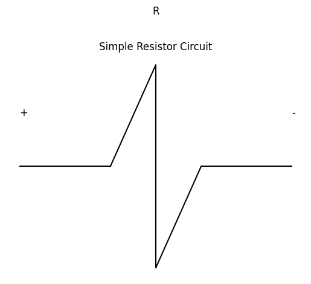
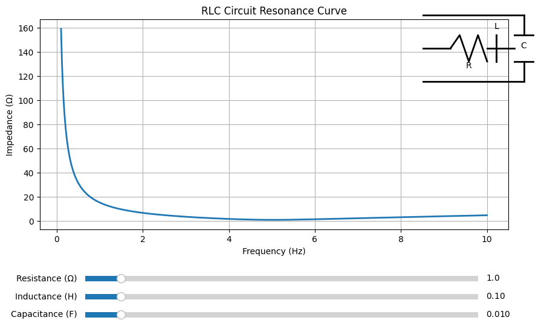
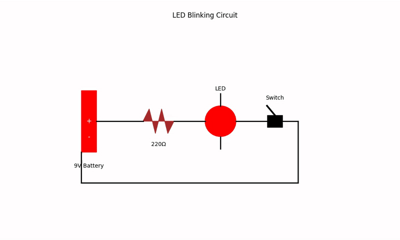
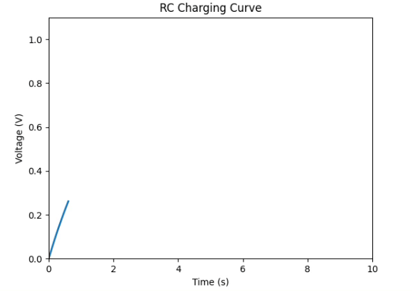
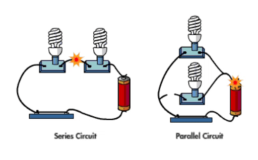

# Problem 1

# Equivalent Resistance Using Graph Theory

## Graph Representation

- **Nodes**: Electrical junctions (including terminals A and B).
- **Edges**: Resistors with resistance values \( R \).
- The network is represented as an **undirected weighted graph**:
  - Nodes = junctions.
  - Edges = resistors labeled with resistance \( R \).

If multiple resistors connect the same pair of nodes, treat them as **parallel** resistors immediately.

---

## Identifying Series and Parallel

### Series:
Two resistors are in **series** if:
- They share a **common node** \( v \) of **degree 2**, and
- \( v \) is **not** a terminal node (not A or B).

Then:
- Edges \( (u - v) \) and \( (v - w) \) are replaced by a single edge \( (u - w) \).
- The equivalent resistance is:

$$
R_{\text{series}} = R_{uv} + R_{vw}
$$

---

### Parallel:
Two or more resistors between the **same pair of nodes** \( (u, w) \) are in **parallel**. They are replaced with a single resistor using:

$$
\frac{1}{R_{\text{parallel}}} = \sum_{i=1}^{k} \frac{1}{R_i}
$$

or equivalently,

$$
R_{\text{parallel}} = \left( \sum_{i=1}^{k} \frac{1}{R_i} \right)^{-1}
$$

# Option 2: Advanced Task – Full Implementation

## Objective

Implement an algorithm to compute the **equivalent resistance** between two nodes in an arbitrary resistor network using **graph theory**.

---

## Requirements

The implementation must:

- Accept a circuit graph as input (nodes and resistors as edges).
- Support **arbitrary configurations**, including **nested** series and parallel combinations.
- Output the final **equivalent resistance** between two designated terminals.

---

## Mathematical Background

### Series Combination

If two resistors are in series:

$$
R_{\text{eq}} = R_1 + R_2
$$

---

### Parallel Combination

If two or more resistors are in parallel:

$$
\frac{1}{R_{\text{eq}}} = \sum_{i=1}^{n} \frac{1}{R_i} \quad \Rightarrow \quad R_{\text{eq}} = \left( \sum_{i=1}^{n} \frac{1}{R_i} \right)^{-1}
$$

## Mathematical Formulation

The algorithm works by recursively applying the series and parallel resistance formulas:

### Series Connection:
For resistors $R_1, R_2, \ldots, R_n$ in series:

$$ R_{eq} = \sum_{i=1}^{n} R_i $$

### Parallel Connection: 
For resistors $R_1, R_2, \ldots, R_n$ in parallel:

$$ R_{eq} = \left( \sum_{i=1}^{n} \frac{1}{R_i} \right)^{-1} $$

## Features

### Arbitrary Nesting:
- Handles complex networks like $S(P(S(1,2),3), P(4,5))$
- Each operation node contains exactly two children (binary tree)

### String Parsing:
- Optional string input format: `"S(P(1,2),3)"` for $(1 \parallel 2) + 3$

### Error Handling:
- Validates network structure
- Checks for invalid resistor values

## Example Calculation

For the network $(1 \parallel 2) + (3 \parallel 4) + 5$:

1. **Parallel branches first**:
   $$ 1 \parallel 2 = \frac{1}{\frac{1}{1} + \frac{1}{2}} = 0.6667\ \Omega $$
   $$ 3 \parallel 4 = \frac{1}{\frac{1}{3} + \frac{1}{4}} = 1.7143\ \Omega $$

2. **Series combination**:
   $$ R_{eq} = 0.6667 + 1.7143 + 5 = 7.3810\ \Omega $$

The code outputs this result with 2 decimal places: $7.38\ \Omega$.

