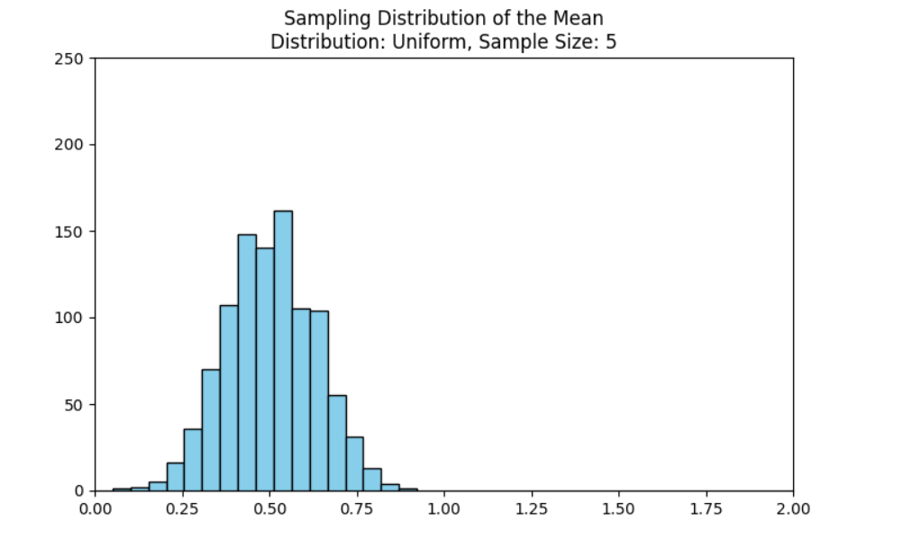
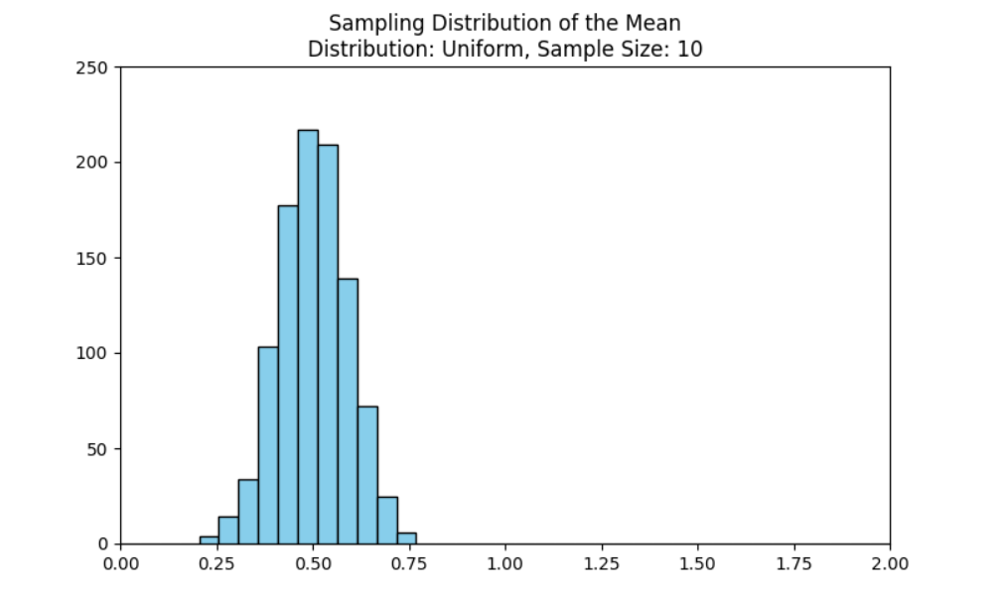
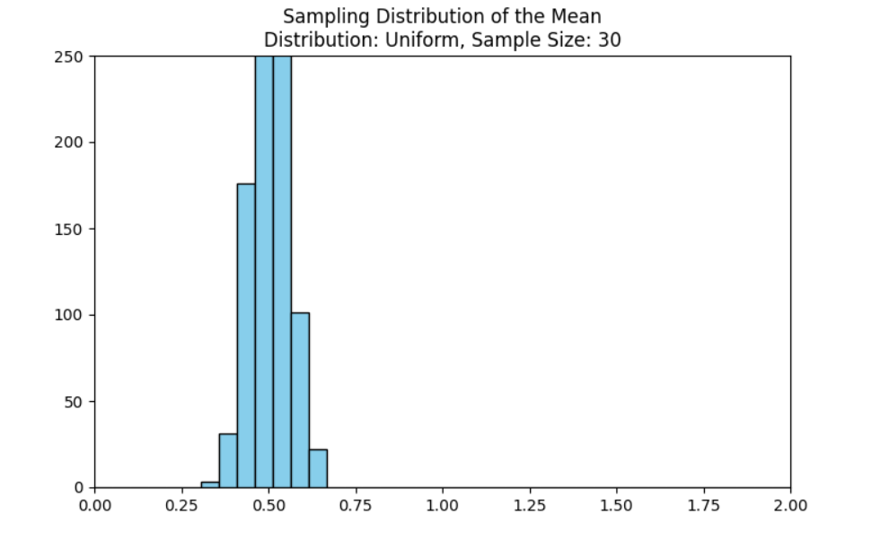
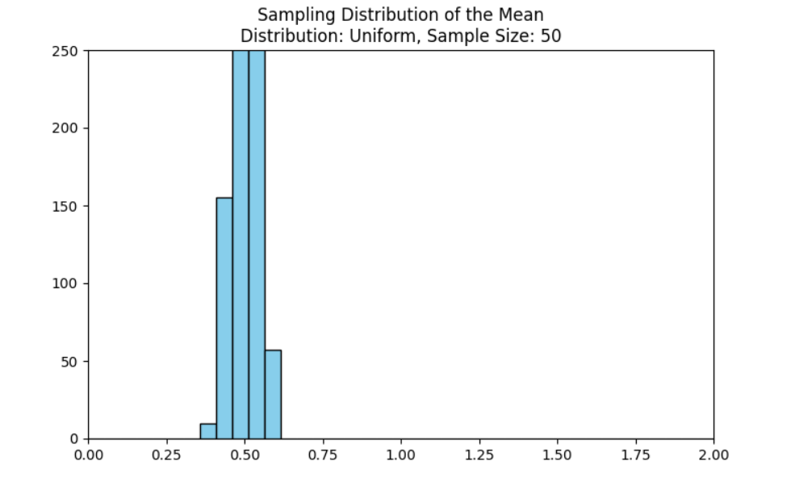
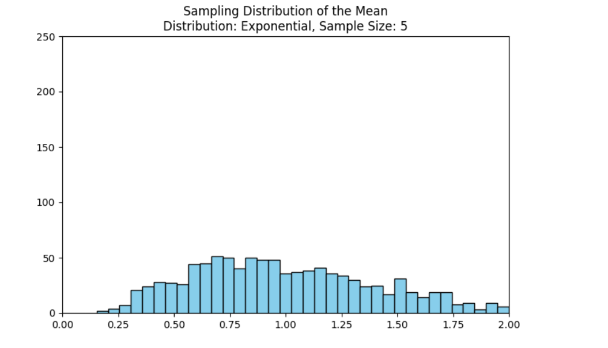
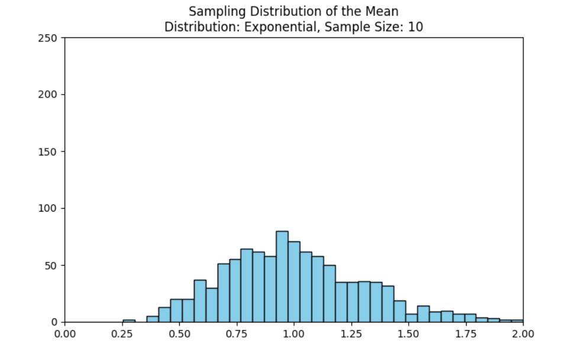
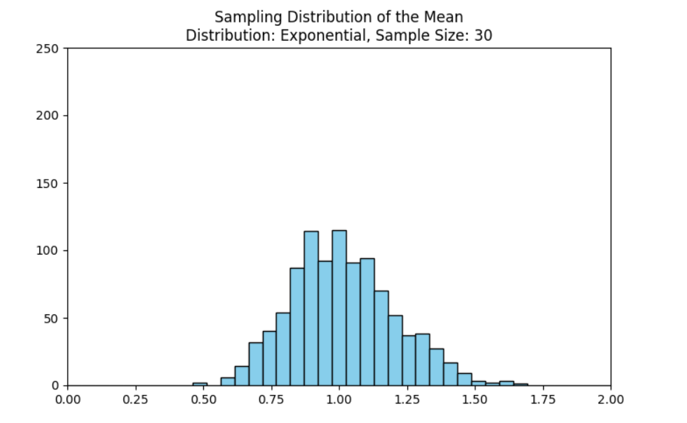
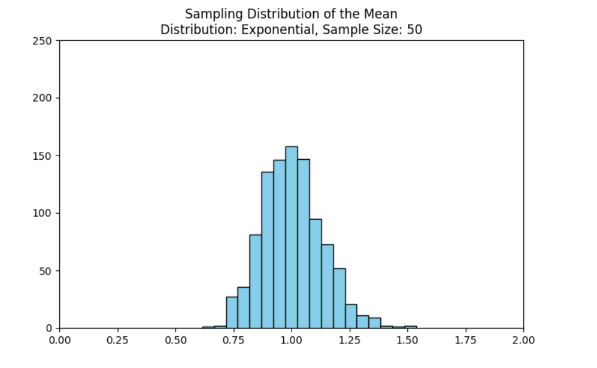

# Problem 1

# Exploring the Central Limit Theorem through simulations

## 1. Simulating Population Distributions

#### 1. Uniform Distribution
$$ X \sim \text{Uniform}(a, b) $$

#### 2. PDF:
$$ f_X(x) = \frac{1}{b - a}, \quad a \leq x \leq b $$

#### 3. Mean:
$$ \mu = \frac{a + b}{2} $$

#### 4. Variance:
$$ \sigma^2 = \frac{(b - a)^2}{12} $$

#### 5. Exponential Distribution
$$ X \sim \text{Exponential}(\lambda) $$

#### 6. PDF:
$$ f_X(x) = \lambda e^{-\lambda x}, \quad x \geq 0 $$

#### 7. Mean:
$$ \mu = \frac{1}{\lambda} $$

#### 8. Variance:
$$ \sigma^2 = \frac{1}{\lambda^2} $$

#### 9. Binomial Distribution
$$ X \sim \text{Binomial}(n, p) $$

#### 10. PMF:
$$ P(X = k) = \binom{n}{k} p^k (1 - p)^{n - k}, \quad k = 0, 1, \ldots, n $$

#### 11. Mean:
$$ \mu = n p $$

#### 12. Variance:
$$ \sigma^2 = n p (1 - p) $$

For each distribution, generate a large "population" sample of size \( N \) (e.g., \( N = 100,000 \)).

## 2. Sampling & Visualization

1. **Draw Random Samples**  
   For each population, and for each sample size \(n\in\{5,10,30,50\}\):
   - Repeat \(M\) times (e.g., \(M=1{,}000\)):
     1. Take a random sample \(X_1, X_2, \dots, X_n\).
     2. Compute the sample mean  
        $$\bar{X} = \frac{1}{n}\sum_{i=1}^n X_i.$$
   - Collect the \(M\) values of \(\bar{X}\) to form the **sampling distribution** of the mean.

2. **Plot Histograms**  
   - For each \(n\), plot a histogram of the \(M\) sample means.
   - Overlay the Normal PDF with parameters  
     $$\mu_{\bar X} = \mu,\quad \sigma_{\bar X} = \frac{\sigma}{\sqrt{n}}.$$
   - Observe how, as \(n\) increases, the histogram approaches  
     $$\bar{X} \ \xrightarrow{d}\ \mathcal{N}\!\Bigl(\mu,\,\tfrac{\sigma^2}{n}\Bigr).$$

---

## 3. Parameter Exploration

- **Shape of Original Distribution**  
  - **Skewed** distributions (e.g., Exponential) require larger \(n\) before the sampling distribution appears Normal.
  - **Symmetric** distributions (e.g., Uniform) converge more quickly.

- **Effect of Variance**  
  - A larger population variance \(\sigma^2\) yields a wider sampling distribution:
    $$\mathrm{Var}(\bar{X}) = \frac{\sigma^2}{n}.$$
  - Doubling \(\sigma^2\) doubles the spread of \(\bar{X}\), but increasing \(n\) reduces spread by \(1/n\).

- **Rate of Convergence**  
  - For distributions with **finite** higher moments, the Berry–Esseen theorem gives a bound on the convergence rate:
    $$\sup_x \Bigl| F_n(x) - \Phi(x)\Bigr| \le \frac{C\,\rho}{\sigma^3\sqrt{n}},$$  
    where \(\rho = \mathbb{E}\!\bigl|X - \mu\bigr|^3\) and \(C\) is a constant.

---

## 4. Practical Applications of the CLT

1. **Estimating Population Parameters**  
   - Confidence intervals for a population mean use  
     $$\bar{X} \pm z_{\,\alpha/2}\,\frac{\sigma}{\sqrt{n}}.$$

2. **Quality Control in Manufacturing**  
   - Monitor sample means of product dimensions to detect shifts from target:
     $$ \bar{X} \sim \mathcal{N}\!\Bigl(\mu_0,\tfrac{\sigma^2}{n}\Bigr). $$

3. **Financial Modeling**  
   - Aggregated returns over many assets or time intervals often assumed Normally distributed:
     $$ R = \sum_{i=1}^n r_i,\quad r_i\sim\text{IID}, $$
     so by CLT,  
     $$ R \approx \mathcal{N}\!\bigl(n\mu,\;n\sigma^2\bigr). $$

