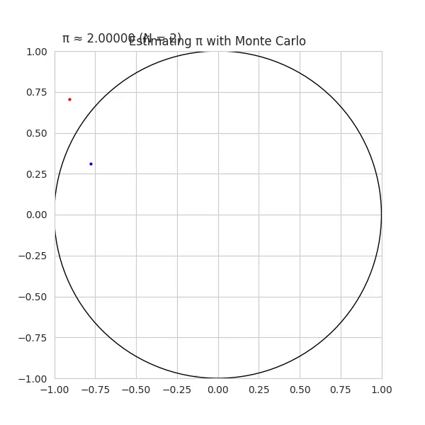
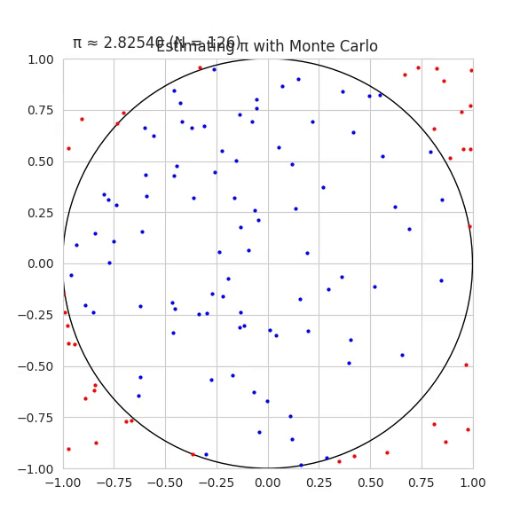
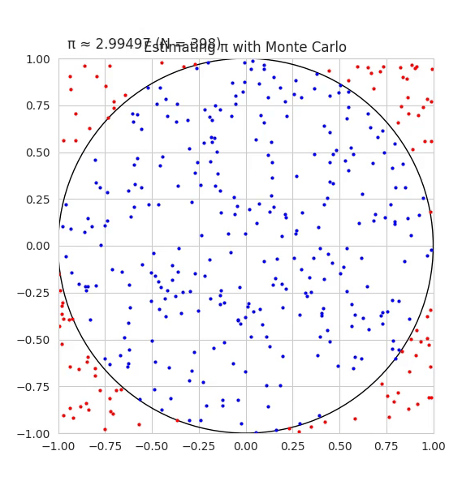
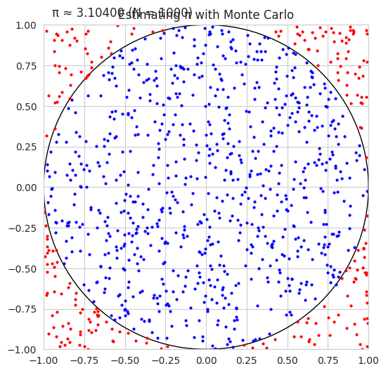
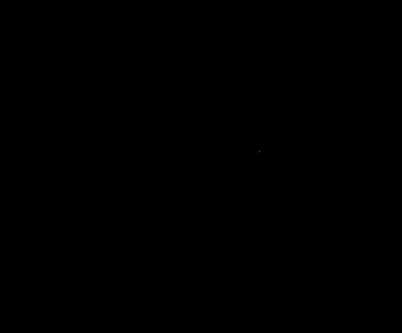
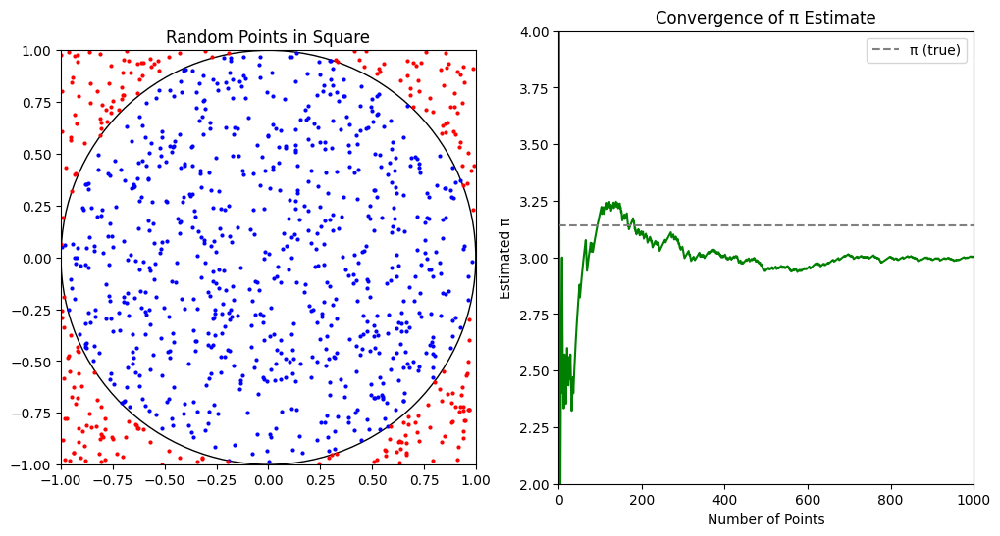
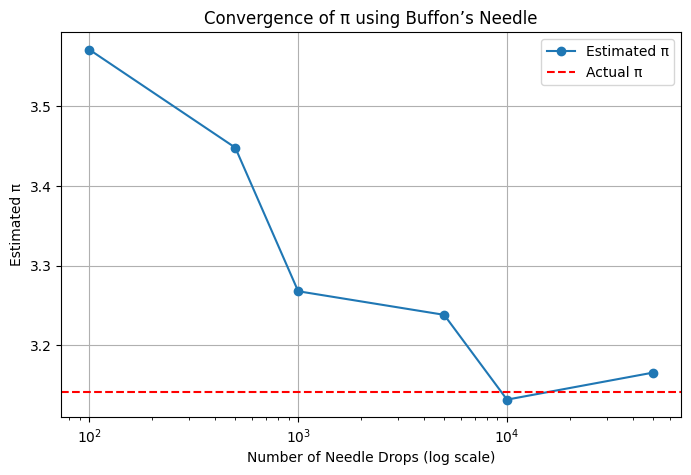
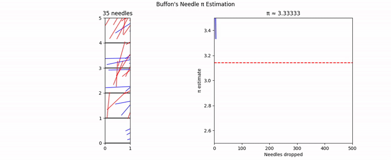
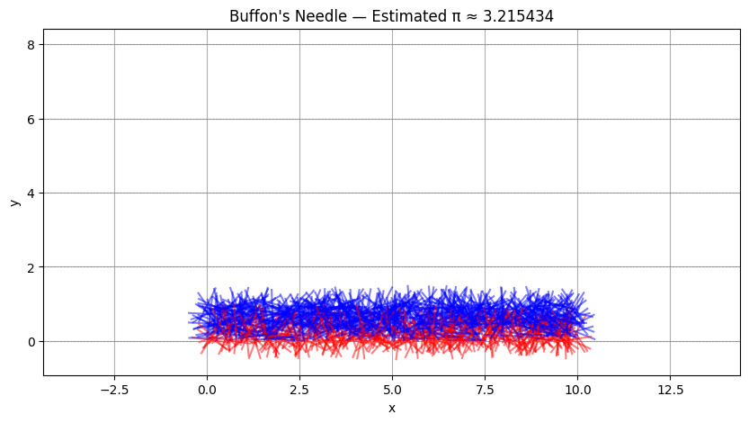
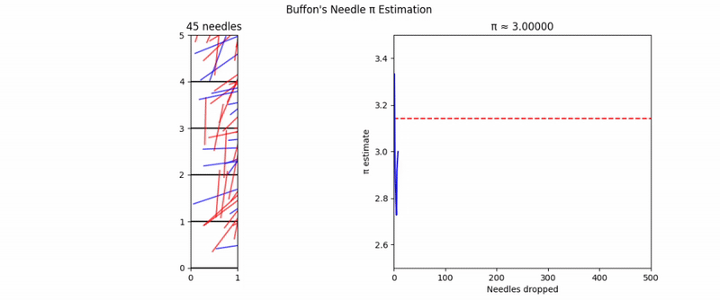

# Problem 2

# Estimating $\pi$ using Monte Carlo Methods

### 1. Theoretical Foundation

To estimate $\pi$ using random points, consider a unit circle inscribed in a square. The circle has a radius $r = 1$, and the square spans from $-1$ to $1$ in both $x$ and $y$ directions.

The area of the unit circle is:

$$
A_{\text{circle}} = \pi r^2 = \pi
$$

The area of the square is:

$$
A_{\text{square}} = (2r)^2 = 4
$$

If we randomly generate points uniformly within the square, the probability that a point lies inside the circle is:

$$
P = \frac{A_{\text{circle}}}{A_{\text{square}}} = \frac{\pi}{4}
$$

Solving for $\pi$ gives:

$$
\pi \approx 4 \cdot \frac{\text{Number of points inside the circle}}{\text{Total number of points}}
$$

### 2. Simulation

1. Generate $N$ random points $(x, y)$ in the square $[-1, 1] \times [-1, 1]$.
2. Count how many fall inside the unit circle (i.e., those satisfying $x^2 + y^2 \leq 1$).
3. Estimate $\pi$ using:

$$
\pi \approx 4 \cdot \frac{N_{\text{inside}}}{N_{\text{total}}}
$$

### 3. Visualization

A plot can show:

- Points **inside** the circle in **blue**
- Points **outside** the circle in **red**
- The **unit circle** boundary

This visually demonstrates how random sampling approximates the circle's area.

### 4. Analysis

- As $N \rightarrow \infty$, the estimate of $\pi$ converges to the true value.
- The convergence rate is $O(1/\sqrt{N})$, typical for Monte Carlo methods.
- Accuracy increases slowly, so large numbers of samples are needed for high precision.
- Monte Carlo integration is simple but computationally inefficient compared to analytical methods.

---

## Part 2: Estimating $\pi$ Using Buffon’s Needle

### 1. Theoretical Foundation

Buffon's Needle is a probability problem: Drop a needle of length $L$ onto a plane with parallel lines spaced a distance $d$ apart ($L \leq d$). The probability that the needle crosses a line is:

$$
P = \frac{2L}{\pi d}
$$

Rearranging to estimate $\pi$:

$$
\pi \approx \frac{2L \cdot N_{\text{total}}}{d \cdot N_{\text{cross}}}
$$

Where:
- $N_{\text{total}}$ = total number of needle drops
- $N_{\text{cross}}$ = number of times the needle crosses a line

### 2. Simulation

1. Randomly simulate dropping a needle:
   - Random angle $\theta \in [0, \pi]$
   - Random distance from center to nearest line $x \in [0, d/2]$
2. The needle crosses a line if:

$$
x \leq \frac{L}{2} \sin(\theta)
$$

3. Count the number of crossings and estimate $\pi$:

$$
\pi \approx \frac{2L \cdot N_{\text{total}}}{d \cdot N_{\text{cross}}}
$$

### 3. Visualization

A diagram should show:

- Horizontal parallel lines spaced at distance $d$
- Needles randomly placed, with crossing ones in a distinct color
- This illustrates the relationship between geometry and probability

### 4. Analysis

- Like the circle method, this converges slowly: $O(1/\sqrt{N})$
- More complex to implement due to trigonometric calculations
- It offers historical and theoretical interest but is less practical for accurate estimation of $\pi$
- For small numbers of trials, the result is very noisy

---

## Comparison of Methods

| Method              | Convergence Rate | Complexity | Practicality |
|---------------------|------------------|------------|--------------|
| Monte Carlo Circle  | $O(1/\sqrt{N})$  | Easy       | High         |
| Buffon’s Needle     | $O(1/\sqrt{N})$  | Moderate   | Moderate     |

Both methods highlight the deep connections between geometry, probability, and numerical estimation.

## Animation 1









## Animation 2



## Animation 3
```python
import numpy as np
import matplotlib.pyplot as plt
from matplotlib.animation import FuncAnimation
from IPython.display import HTML

# Use default style for compatibility
plt.style.use('default')

# Simulation settings
total_points = 1000
x = np.random.uniform(-1, 1, total_points)
y = np.random.uniform(-1, 1, total_points)

# Setup figure with two subplots
fig, (ax_circle, ax_pi) = plt.subplots(1, 2, figsize=(12, 6))

# Left plot: Unit circle
ax_circle.set_xlim(-1, 1)
ax_circle.set_ylim(-1, 1)
ax_circle.set_aspect('equal')
ax_circle.set_title('Random Points in Square')
circle = plt.Circle((0, 0), 1, color='black', fill=False)
ax_circle.add_patch(circle)

inside_scatter = ax_circle.plot([], [], 'bo', markersize=2, label='Inside')[0]
outside_scatter = ax_circle.plot([], [], 'ro', markersize=2, label='Outside')[0]

# Right plot: π estimate over time
ax_pi.set_xlim(0, total_points)
ax_pi.set_ylim(2, 4)
ax_pi.set_title('Convergence of π Estimate')
ax_pi.set_xlabel('Number of Points')
ax_pi.set_ylabel('Estimated π')
line_pi, = ax_pi.plot([], [], 'g-')

true_pi = np.pi
ax_pi.axhline(y=true_pi, color='gray', linestyle='--', label='π (true)')
ax_pi.legend()

# Storage
xin, yin = [], []
xout, yout = [], []
pi_estimates = []

def init():
    inside_scatter.set_data([], [])
    outside_scatter.set_data([], [])
    line_pi.set_data([], [])
    return inside_scatter, outside_scatter, line_pi

def update(i):
    xi, yi = x[i], y[i]
    if xi**2 + yi**2 <= 1:
        xin.append(xi)
        yin.append(yi)
    else:
        xout.append(xi)
        yout.append(yi)

    inside_scatter.set_data(xin, yin)
    outside_scatter.set_data(xout, yout)

    N = i + 1
    pi_est = 4 * len(xin) / N
    pi_estimates.append(pi_est)

    line_pi.set_data(range(1, N + 1), pi_estimates)

    return inside_scatter, outside_scatter, line_pi

anim = FuncAnimation(fig, update, frames=total_points, init_func=init,
                     interval=20, blit=True)

# Render animation as HTML5 video
HTML(anim.to_jshtml())
```




# Estimating π using Monte Carlo Simulation

This animation demonstrates how we can estimate the value of π by simulating random points in a square that bounds a unit circle.

---

## Theoretical Foundation

Consider a square of side length 2 centered at the origin, and a unit circle (radius = 1) also centered at the origin.

The **area** of the square is:

$$
A_{\text{square}} = (2 \cdot 1)^2 = 4
$$

The **area** of the circle is:

$$
A_{\text{circle}} = \pi \cdot r^2 = \pi \cdot 1^2 = \pi
$$

If we randomly generate many points uniformly inside the square, the proportion that falls inside the circle approximates the ratio of the areas:

$$
\frac{\text{Points inside circle}}{\text{Total points}} \approx \frac{\pi}{4}
$$

Solving for π:

$$
\pi \approx 4 \cdot \frac{\text{Points inside}}{\text{Total points}}
$$

---

### Left Plot: Circle Simulation
- The **blue dots** represent random points that fall *inside* the unit circle.
- The **red dots** are points that fall *outside* the circle but still within the square.
- Over time, more points are added, improving the estimate.

---

### Right Plot: π Convergence
- This chart shows how the **estimated value of π** changes as more points are added.
- The **dashed horizontal line** represents the true value of π.
- As the number of points increases, the estimate **converges** toward the true value due to the **Law of Large Numbers**.

---

## Summary

This method:
- Is easy to implement.
- Demonstrates probabilistic estimation.
- Converges slowly (requires a lot of points for high precision).
- Visualizes the randomness and convergence beautifully.

---

## Formula Recap

$$
\pi \approx 4 \cdot \frac{N_{\text{in}}}{N_{\text{total}}}
$$

Where:
- \( N_{\text{in}} \) = number of points inside the circle
- \( N_{\text{total}} \) = total number of points sampled

---

## Using Buffon’s Needle







