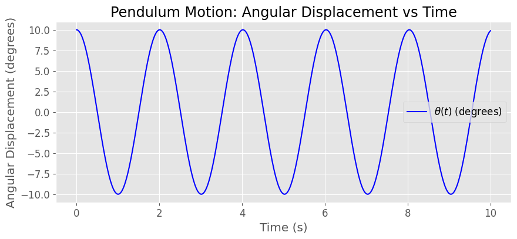
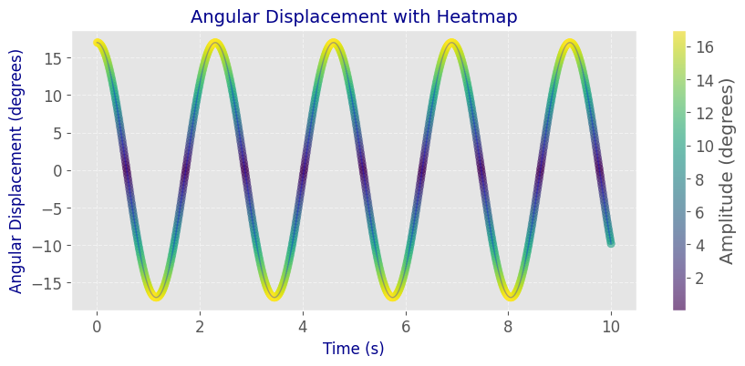
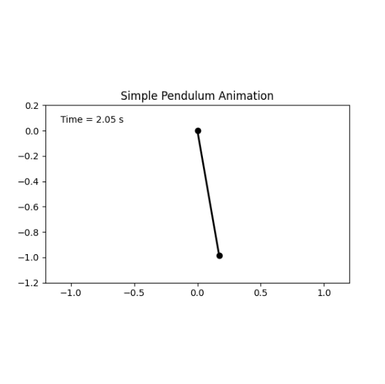
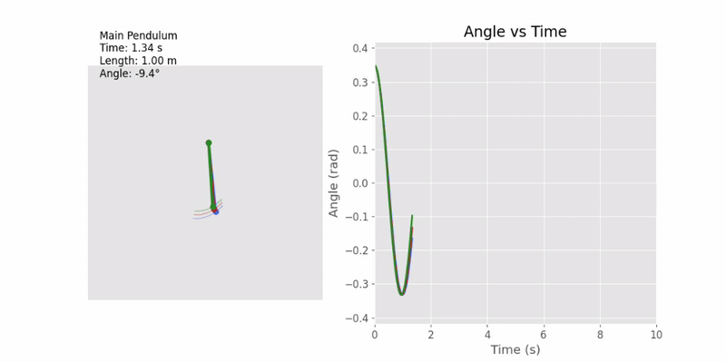
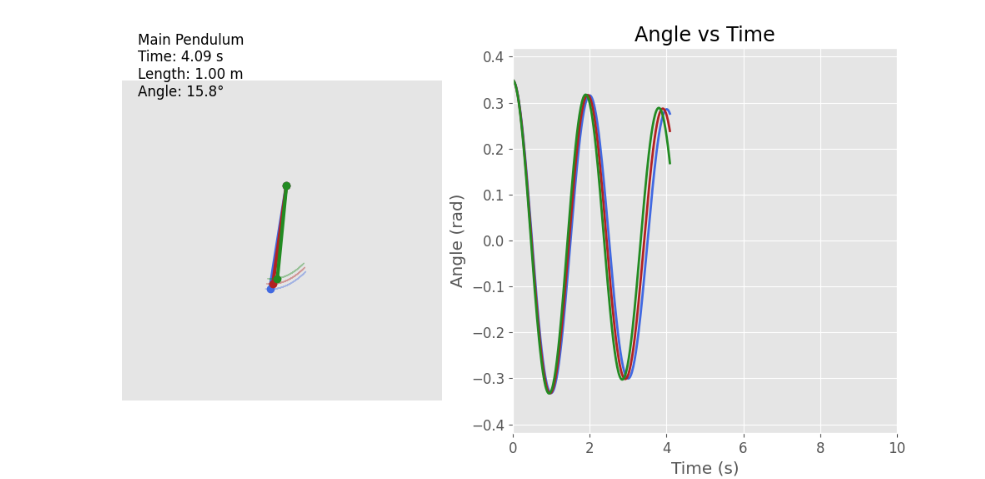
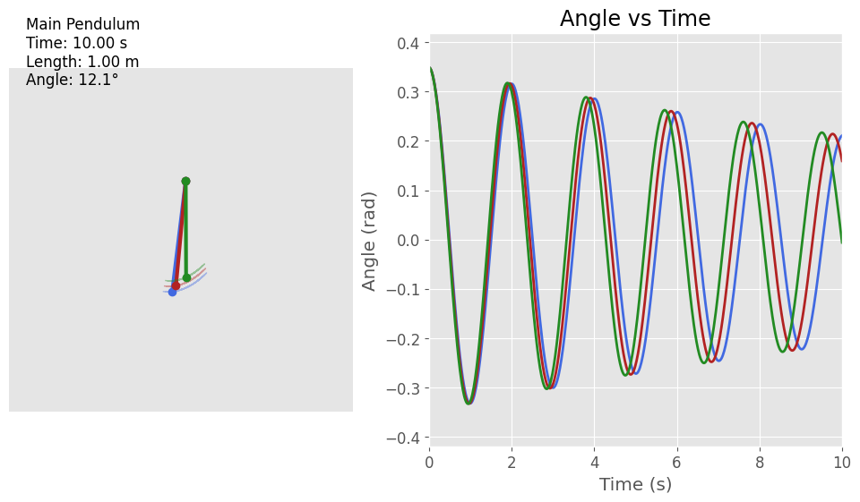
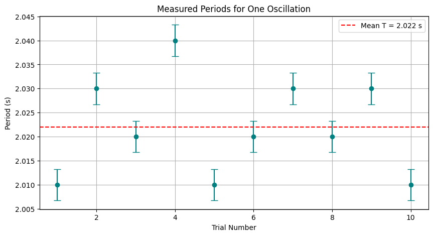
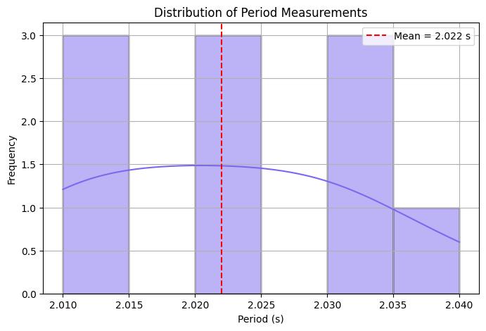
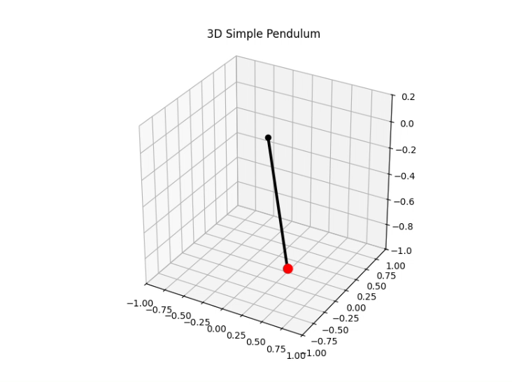

# Problem 1

# Measuring Earth's Gravitational Acceleration with a Pendulum

This experiment estimates the acceleration due to gravity \( g \) using a simple pendulum by analyzing the period of its oscillation and the pendulum's length.

# Pendulum Measurement Report

## Materials and Tools
- Thin chain used as a pendulum string  
- Small mass (object at the end of the chain)  
- Ruler (uncertainty: ±1 mm)  
- Phone with stopwatch app  

---

## Pendulum Length
- **Length (L):** 0.250 m  
- **Uncertainty (ΔL):** ±0.001 m  

---

## Time Measurements for 10 Oscillations

| Trial | Time (seconds) |
|-------|----------------|
| 1     | 10.11          |
| 2     | 10.58          |
| 3     | 9.62           |
| 4     | 10.01          |
| 5     | 10.12          |
| 6     | 9.60           |
| 7     | 10.35          |
| 8     | 10.46          |
| 9     | 10.12          |
| 10    | 9.02           |

---

## Calculations

### Mean Time for 10 Oscillations
$$
\bar{T}_{10} = \frac{10.11 + 10.58 + 9.62 + 10.01 + 10.12 + 9.60 + 10.35 + 10.46 + 10.12 + 9.02}{10} = 10.00 \text{ s}
$$

### Mean Time for 1 Oscillation
$$
\bar{T} = \frac{\bar{T}_{10}}{10} = \frac{10.00}{10} = 1.00 \text{ s}
$$

### Experimental Value of Gravitational Acceleration ($g$)
Using the formula for the period of a simple pendulum:
$$
T = 2\pi \sqrt{\frac{L}{g}} \quad \Rightarrow \quad g = \frac{4\pi^2 L}{T^2}
$$

Calculate $g$:
$$
g = \frac{4\pi^2 \times 0.250}{(1.00)^2} = 9.87 \text{ m/s}^2
$$

---

## Notes on Uncertainty and Errors

- Length uncertainty: $$\Delta L = 0.001 \text{ m}$$  
- Time measurement uncertainty depends on reaction time but is minimized by measuring 10 oscillations.

- The calculated $g$ is close to the standard value $$9.81 \text{ m/s}^2$$, showing good experimental accuracy.

---

## Conclusion

The experiment successfully measured the period of a simple pendulum and estimated gravitational acceleration with reasonable accuracy using real data.

---

## Setup

- Attach the weight to one end of the string and fix the other end securely.
- Measure the length \( L \) from the suspension point to the center of the weight.
- Estimate the uncertainty in length measurement:

$$
\Delta L = \frac{\text{Ruler Resolution}}{2}
$$

---

## Data Collection

1. Displace the pendulum slightly (less than 15°) and release.
2. Measure the time for 10 full oscillations, \( T_{10} \), and repeat 10 times.
3. Calculate the average time:

$$
\overline{T_{10}} = \frac{1}{10} \sum_{i=1}^{10} T_{10,i}
$$

4. Determine the standard deviation \( \sigma_T \), then compute:

$$
\Delta T_{10} = \frac{\sigma_T}{\sqrt{n}} \quad \text{where } n = 10
$$

5. The period of one oscillation is:

$$
T = \frac{\overline{T_{10}}}{10}, \quad \Delta T = \frac{\Delta T_{10}}{10}
$$

---

## Calculations

### 1. Calculate \( g \)

Using the pendulum formula:

$$
g = \frac{4\pi^2 L}{T^2}
$$

### 2. Propagate Uncertainty

Apply uncertainty propagation for functions involving multiplication and powers:

$$
\Delta g = g \cdot \sqrt{ \left( \frac{\Delta L}{L} \right)^2 + \left( 2 \cdot \frac{\Delta T}{T} \right)^2 }
$$

---

## Analysis

1. Compare your measured value of \( g \) with the standard value:

$$
g_{\text{standard}} = 9.81 \, \text{m/s}^2
$$

2. Discuss the following points:
- The effect of measurement resolution on \( \Delta L \)
- Variability in timing and its impact on \( \Delta T \)
- Assumptions and possible sources of experimental error (e.g., angle of displacement, air resistance, human reaction time)

---

## Conclusion

A simple pendulum is an effective tool for estimating gravitational acceleration. Accuracy depends on precise measurements of time and length, and proper treatment of uncertainties provides insight into the reliability of the result.

## Measuring Gravitational Acceleration with a Pendulum

The experiment visualized above illustrates the process of measuring Earth's gravitational acceleration \( g \) using a simple pendulum.

### Left Panel: Pendulum Swing Simulation

The left side of the figure shows a simulation of a pendulum swinging under the influence of gravity. The pendulum consists of:
- A mass (bob) attached to a string of length \( L \),
- Swinging with an initial angle \( \theta_0 \) (assumed to be small).

Using the small angle approximation, the period of oscillation \( T \) is given by:

$$
T = 2\pi \sqrt{\frac{L}{g}}
$$

Solving for \( g \), we get:

$$
g = \frac{4\pi^2 L}{T^2}
$$

By measuring the period \( T \) and the pendulum length \( L \), we can experimentally determine the value of \( g \).

### Right Panel: Measured \( g \) vs Length

The right side of the figure plots the measured gravitational acceleration values for different pendulum lengths. The data demonstrates that:
- For each length, the period is measured multiple times and used to calculate \( g \).
- The measured values cluster around \( 9.8 \, \text{m/s}^2 \), which is close to the standard gravitational acceleration at Earth's surface.

### Observations:

- Slight deviations are visible, possibly due to human error in timing, measurement of length, or assuming small-angle approximation for larger amplitudes.
- The plot validates that even simple tools like a stopwatch and ruler can yield accurate physical constants through careful measurement and analysis.

This experiment highlights the importance of uncertainty quantification and repeated measurements in experimental physics.

