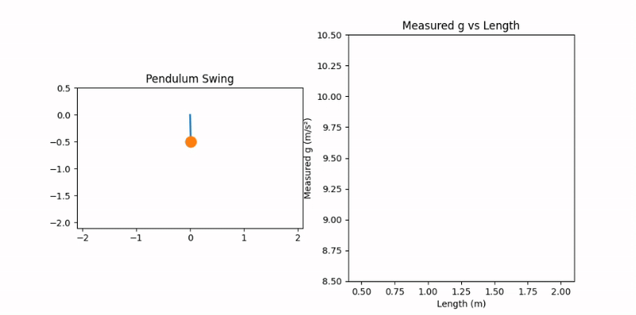
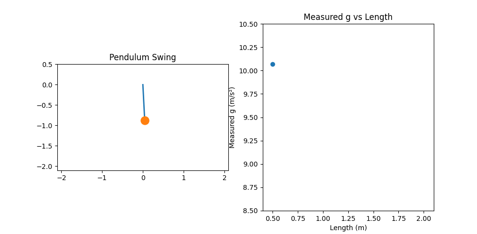
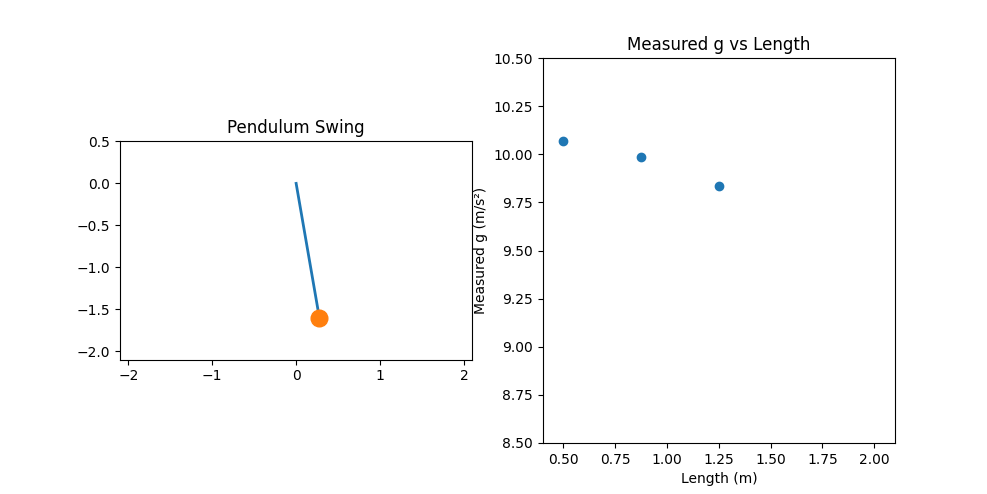
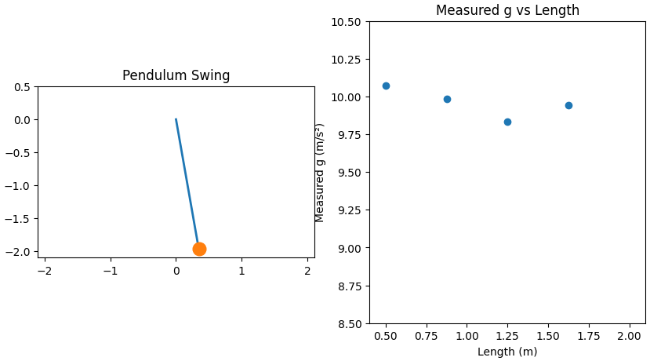

# Problem 1

# Measuring Earth's Gravitational Acceleration with a Pendulum

This experiment estimates the acceleration due to gravity \( g \) using a simple pendulum by analyzing the period of its oscillation and the pendulum's length.

---

## Materials

- String (1 or 1.5 meters)
- Small mass (e.g., key chain, bag of coins)
- Stopwatch (or phone timer)
- Ruler or measuring tape

---

## Setup

- Attach the weight to one end of the string and fix the other end securely.
- Measure the length \( L \) from the suspension point to the center of the weight.
- Estimate the uncertainty in length measurement:

$$
\Delta L = \frac{\text{Ruler Resolution}}{2}
$$

---

## Data Collection

1. Displace the pendulum slightly (less than 15°) and release.
2. Measure the time for 10 full oscillations, \( T_{10} \), and repeat 10 times.
3. Calculate the average time:

$$
\overline{T_{10}} = \frac{1}{10} \sum_{i=1}^{10} T_{10,i}
$$

4. Determine the standard deviation \( \sigma_T \), then compute:

$$
\Delta T_{10} = \frac{\sigma_T}{\sqrt{n}} \quad \text{where } n = 10
$$

5. The period of one oscillation is:

$$
T = \frac{\overline{T_{10}}}{10}, \quad \Delta T = \frac{\Delta T_{10}}{10}
$$

---

## Calculations

### 1. Calculate \( g \)

Using the pendulum formula:

$$
g = \frac{4\pi^2 L}{T^2}
$$

### 2. Propagate Uncertainty

Apply uncertainty propagation for functions involving multiplication and powers:

$$
\Delta g = g \cdot \sqrt{ \left( \frac{\Delta L}{L} \right)^2 + \left( 2 \cdot \frac{\Delta T}{T} \right)^2 }
$$

---

## Analysis

1. Compare your measured value of \( g \) with the standard value:

$$
g_{\text{standard}} = 9.81 \, \text{m/s}^2
$$

2. Discuss the following points:
- The effect of measurement resolution on \( \Delta L \)
- Variability in timing and its impact on \( \Delta T \)
- Assumptions and possible sources of experimental error (e.g., angle of displacement, air resistance, human reaction time)

---

## Conclusion

A simple pendulum is an effective tool for estimating gravitational acceleration. Accuracy depends on precise measurements of time and length, and proper treatment of uncertainties provides insight into the reliability of the result.

